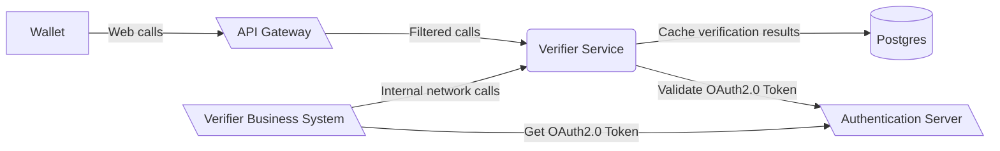

<!--
SPDX-FileCopyrightText: 2025 Swiss Confederation

SPDX-License-Identifier: MIT
-->


# SWIYU generic verifier service

This software is a web server implementing the technical standards as specified in
the [swiyu Trust Infrastructure Interoperability Profile](https://swiyu-admin-ch.github.io/specifications/interoperability-profile/).
Together with the other generic components provided, this software forms a collection of APIs allowing issuance and
verification of verifiable credentials without the need of reimplementing the standards.

The generic verifier service provides in its management interface the possibility to initiate a verification process and
in the oid4vp interface the necessary tools to verify a verifiable presentation.

The management interface should be only accessible from inside the organization. Whereas the oid4vp interface needs to
be accessible by the wallet.

## Table of Contents

- [Deployment](#deployment)
- [Development](#development)
- [Usage](#usage)
- [Missing Features and Known Issues](#missing-features-and-known-issues)
- [Contributions and feedback](#contributions-and-feedback)
- [License](#license)

# Deployment

> Please make sure that you did the following before starting the deployment:
>
> - Generated the signing keys file with the didtoolbox.jar
> - Generated a DID which is registered on the identifier registry
> - Registered yourself on the swiyuprobeta portal
> - Registered yourself on the api self-service portal

## 1. Set the environment variables

A sample compose file for an entire setup of both components and a database can be found
in [sample.compose.yml](sample.compose.yml) file.
**Replace all placeholder <VARIABLE_NAME>**. In addition to that you need to adapt
the [verifier metadata](sample.compose.yml#L35) to your use case.
Those information will be provided to the holder on a dedicated endpoint serving as metadata information of your
verifier.

Please be aware that the **oid4vp** endpoints need to be publicly accessible and set in the environment variable
`EXTERNAL_URL`.

## 2. Creating a verification

> For a detailed understanding of the verification process and the data structure of verification please consult the
> [DIF presentation exchange specification](https://identity.foundation/presentation-exchange/#presentation-definition).
> For more information on the general verification flow consult
> the [OpenID4VP specification](https://openid.net/specs/openid-4-verifiable-presentations-1_0-20.html)

Once the components are deployed you can create your first verification. For this you first need to define a
presentation
definition. Based on that definition you can then create a verification request for a holder as shown in the example
below.
In this case we're asking for a credential called "my-custom-vc" which should at least have the attributes
firstName and lastName. The following request can be performed by using the swagger endpoint on https://<EXTERNAL_URL of
verifier-agent-management>**/swagger-ui/index.html**

To see more details and examples of the verification process please consult the [documentation](documentation/verification_process.md).

## Digital Credentials Query Language (DCQL) Transition

### Overview
The verifier service now supports the Digital Credentials Query Language (DCQL) as specified in the OpenID for Verifiable Presentations (OID4VP) Standard 1.0. This replaces the previous DIF Presentation Exchange (PE) specification that was integrated into the "claims" request parameter.

### Why DCQL?
- **Standards Compliance**: Ensures compliance with the OID4VP Standard 1.0
- **Enhanced Flexibility**: DCQL provides a JSON-encoded query language for simpler and more flexible presentation requests
- **Improved Privacy**: Enables precise specification of credential requirements and individual claims, supporting selective disclosure
- **Complex Scenarios Support**: Allows encoding constraints for credential combinations and expressing various alternatives

### Key Interface Changes
The service now supports both DCQL and PE formats through:
- Optional `dcql_query` parameter alongside existing `presentation_definition`
- API version headers for backward compatibility:
  - Version "1": Supports OID4VP ID2 with DIF Presentation Exchange
  - Version "2": Supports OID4VP 1.0 with DCQL

### Verification Flow with DCQL
1. **Creation**: Business Verifier creates verification request with DCQL query
2. **Storage**: Verifier Service stores request in database
3. **Holder Retrieval**: Holder uses Verification URI to get request object containing DCQL query
4. **Presentation**: Holder's wallet processes DCQL query to identify suitable credentials
5. **Verification**: Service validates credentials against DCQL query criteria
6. **Status Update**: Business Verifier receives status and requested data via polling or webhooks

### VP Token Response Encryption
- Required after transition period
- Uses client_metadata for encryption information


## Deployment Considerations
Please note that by default configuration the verifier service is set up in a way to easily gain experience with the verification process,
not as a productive deployment. With the configuration options found below, it can be configured and set up for productive use.

We recommend to not expose the service directly to the web. 
The focus of the application lies in the functionality of the verification. 
Using API Gateway or Web Application Firewall can decrease the attack surface significantly.

To prevent misuse, the management endpoints should be protected either by network infrastructure (for example mTLS) or using OAuth.




# Development

> Please be aware that this section **focus on the development of the verifier service**. For the deployment of
> the component please consult [deployment section](#Deployment).

## Single service development

Run the following commands to start the service. This will also spin up a local postgres database from
the docker compose.yml:

```shell
./mvnw -f verifier-application  spring-boot:run -Dspring-boot.run.profiles=local # start spring boot java application
```

After the start api definitions can be found [here](http://localhost:8080/swagger-ui/index.html)

### Updating Openapi Spec

The `openapi.yaml` can be updated by using the generate-doc profile.

```
mvn verify -P generate-doc
```

## Configuration

### Generate Keys

Currently only EC 256 keys are used.
Generate private key with:
`openssl ecparam -genkey -name prime256v1 -noout -out ec_private.pem`
Remember to keep private keys private and safe. It should never be transmitted, etc.

On the base registry the public key is published. To generate the public key form the private key we can use
`openssl ec -in private.pem -pubout -out ec_public.pem`

### Environment variables

| Variable                          | Description                                                                                                                                                                                                | Type             | Default      |
|-----------------------------------|------------------------------------------------------------------------------------------------------------------------------------------------------------------------------------------------------------|------------------|--------------| 
| POSTGRES_USER                     | Username to connect to the Verifier Database                                                                                                                                                               | string           | none         |
| POSTGRES_PASSWORD                 | Username to connect to the Verifier Database                                                                                                                                                               | string           | none         |
| POSTGRES_JDBC                     | JDBC Connection string to the shared DB                                                                                                                                                                    | string           | none         |
| VERIFICATION_TTL_SEC              | Validity period in seconds of an verification offer                                                                                                                                                        | int              | 900          |
| DATA_CLEAR_PROCESS_INTERVAL_MS    | Interval in which expired offers should be removed from cache in milliseconds.                                                                                                                             | int              | 420000       |
| MONITORING_BASIC_AUTH_ENABLED     | Enables basic auth protection of the /actuator/prometheus endpoint. (Default: false)                                                                                                                       |
| MONITORING_BASIC_AUTH_USERNAME    | Sets the username for the basic auth protection of the /actuator/prometheus endpoint.                                                                                                                      |
| MONITORING_BASIC_AUTH_PASSWORD    | Sets the password for the basic auth protection of the /actuator/prometheus endpoint.                                                                                                                      |
| STAGE                             | Sets the profiles for the images in the entrypoint file.                                                                                                                                                   |
| EXTERNAL_URL                      | URL of this deployed instance in order to add it to the request                                                                                                                                            | URL              | None         |
| VERIFIER_DID                      | DID of this service-instance to identify the requester                                                                                                                                                     | string (did:tdw) | none         |
| DID_VERIFICATION_METHOD           | The full DID with fragment as used to find the public key for sd-jwt VCs in the DID Document. eg: `did:tdw:<base-registry-url>:<issuer_uuid>#<sd-jwt-public-key-fragment>`                                 | string (did:tdw) | none         |
| SIGNING_KEY                       | Private Key in PEM format used to sign request objects sent to the holder                                                                                                                                  | string           | none         |
| URL_REWRITE_MAPPING               | Json object for url replacements during rest client call. Key represents the original url and value the one which should be used instead (e.g. {"https://mysample1.ch":"https://somethingdiffeerent1.ch"}) | string           | "{}"         |
| OPENID_CLIENT_METADATA_FILE       | Path to the verifier metdata file as shown in the [verifier-agent-management](https://github.com/swiyu-admin-ch/eidch-verifier-agent-management/blob/main/sample.compose.yml) sample                       | string           | None         |
| STATUS_LIST_CACHE_TTL_MILLI       | TTL in milliseconds how long a status list result should be cached. If 0 or less will not cache status lists.                                                                                              | int              | 0            |
| ISSUER_PUBLIC_KEY_CACHE_TTL_MILLI | TTL in milliseconds how long a public key result should be cached                                                                                                                                          | int              | 3600000 (1h) |

### Kubernetes Vault Keys

| Variable           | Description                                                                                      |
|--------------------|--------------------------------------------------------------------------------------------------|
| secret.db.username | Username to connect to the Verifier Database                                                     |
| secret.db.password | Username to connect to the Verifier Database                                                     |
| secret.signing_key | Private Key used to sign the request object sent to the holder - alternative to the env variable |

### HSM - Hardware Security Module

For operations with an HSM, the keys need not be mounted directly into the environment running this application.
Instead, a connection is created to the HSM via JCA. This can be with
the [Sun PKCS11 provider](https://docs.oracle.com/en/java/javase/22/security/pkcs11-reference-guide1.html) or a vendor
specific option.
Note that for creating the keys it is expected that the public key is provided as self-signed certificate.

For vendor specific options it is necessary to provide the library in the java classpath. For this mount or add the necessary jars to the docker container.
Provide the environment variable `JAVA_BOOTCLASSPATH` to the directory which should be added to the classpath.


| Variable                      | Description                                                                                                                                                                                |
|-------------------------------|--------------------------------------------------------------------------------------------------------------------------------------------------------------------------------------------|
| SIGNING_KEY_MANAGEMENT_METHOD | This variable serves as selector. `key` is used for a mounted key. `pkcs11` for the sun pkcs11 selector. For vendor specific libraries the project must be compiled with these configured. |
| HSM_HOST                      | URI of the HSM Host or Proxy to be connected to                                                                                                                                            |
| HSM_PORT                      |                                                                                                                                                                                            |
| HSM_USER                      | User for logging in on the host                                                                                                                                                            |
| HSM_PASSWORD                  | Password for logging in to the HSM                                                                                                                                                         |
| HSM_PROXY_USER                |                                                                                                                                                                                            |
| HSM_PROXY_PASSWORD            |                                                                                                                                                                                            |
| HSM_USER_PIN                  | For some proprietary providers required pin                                                                                                                                                |
| HSM_KEY_ID                    | Key identifier or alias, or label when using pkcs11-tool                                                                                                                                   |
| HSM_KEY_PIN                   | Optional pin to unlock the key                                                                                                                                                             |
| HSM_CONFIG_PATH               | File Path to the HSM config file when using [Sun PKCS11 provider](https://docs.oracle.com/en/java/javase/22/security/pkcs11-reference-guide1.html)                                         |
| HSM_USER_PIN                  | PIN for getting keys from the HSM                                                                                                                                                          |

### Webhook Callbacks

For verifiers, it can be useful to receive a webhook callback from this service
instead of performing active polling to check if a verification has been done.
It is possible to configure a Webhook Callback endpoint, optionally secured by API Key. Please note that delivery of
callback events will be retried until successful, to guarantee an at-least-once delivery.
Failed deliveries will create error logs and be retried in the next interval.

| Variable               | Description                                                                                                                                                                             |
|------------------------|-----------------------------------------------------------------------------------------------------------------------------------------------------------------------------------------|
| WEBHOOK_CALLBACK_URI   | Full URI of the REST endpoint where webhooks shall be sent to. No Callback events will be created if not set.                                                                           |
| WEBHOOK_API_KEY_HEADER | (Optional) API key header, if the callback uri has a api key for protection. Will be used as HTTP header key.                                                                           |
| WEBHOOK_API_KEY_VALUE  | (Optional, Required if WEBHOOK_API_KEY_HEADER is set) The API key used.                                                                                                                 |
| WEBHOOK_INTERVAL       | How often the collected events are sent. Value interpreted as milliseconds if given a plain integer or an [ISO 8601 duration format](https://en.wikipedia.org/wiki/ISO_8601#Durations). | 

Callbacks will be sent on change of verification state. This means the verification can be fetched by the business
verifier.

Callback Object Structure

| Field           | Description                                                                            |
|-----------------|----------------------------------------------------------------------------------------|
| verification_id | ID of the element the callback is about. For now the management id of the verification |
| timestamp       | timestamp the event occurred. Can differ from the time it is sent.                     |

### Security

Management Endpoints can be secured as OAuth2 Resource Server using Spring Security.

For more details see the official [spring security documentation](https://docs.spring.io/spring-security/reference/servlet/oauth2/resource-server/index.html).

For easy playground setup security starts deactivated. It is activated when the appropriate environment variables are set.

#### Fixed single asymmetric key
| Variable                                                    | Description                                                                                                                                                                                        | Type                             |
|-------------------------------------------------------------|----------------------------------------------------------------------------------------------------------------------------------------------------------------------------------------------------|----------------------------------| 
| SPRING_SECURITY_OAUTH2_RESOURCESERVER_JWT_PUBLICKEYLOCATION | URI path to a single public key in pem format. [See Details](https://docs.spring.io/spring-security/reference/servlet/oauth2/resource-server/jwt.html#oauth2resourceserver-jwt-decoder-public-key) | URI eg: file:/app/public-key.pem |


#### Authorization Server
| Variable                                                | Description                                                                                                                                                                                                                                                                        | Type         |
|---------------------------------------------------------|------------------------------------------------------------------------------------------------------------------------------------------------------------------------------------------------------------------------------------------------------------------------------------|--------------| 
| SPRING_SECURITY_OAUTH2_RESOURCESERVER_JWT_ISSUERURI     | URI to the issuer including path component. Will be resolved to <issuer-uri>/.well-known/openid-configuration to fetch the public key [See Details](https://docs.spring.io/spring-security/reference/servlet/oauth2/resource-server/jwt.html#_specifying_the_authorization_server) | URI / String |
| SPRING_SECURITY_OAUTH2_RESOURCESERVER_JWT_JWKSETURI     | URI directly to fetch directly the jwk-set instead of fetching the openid connect first.                                                                                                                                                                                           | URI / String |
| SPRING_SECURITY_OAUTH2_RESOURCESERVER_JWT_JWSALGORITHMS | List of algorithms supported for the key of the jkw-set. Defaults to only RS256.                                                                                                                                                                                                   | String       |

Other properties as defined by spring can be used.


Multitenancy is not supported.

## Usage

### Perform a verification

To perform a verification, it is required to first create the request. This is done with
the `POST /management/verifications`
endpoint.
What data is requested can be selected by adding in additional fields only containing "path".
Filters are currently only supported for `$.vct` - the Verifiable Credential Type.
In the following example we request to have the dateOfBirth revealed to us from a Credential with the type "test-sdjwt".

```json
{
    "id": "00000000-0000-0000-0000-000000000000",
    "name": "Example Verification",
    "purpose": "We want to test a new Verifier",
    "input_descriptors": [
        {
            "id": "11111111-1111-1111-1111-111111111111",
            "name": "Example Data Request",
            "format": {
                "vc+sd-jwt": {
                    "sd-jwt_alg_values": [
                        "ES256"
                    ],
                    "kb-jwt_alg_values": [
                        "ES256"
                    ]
                }
            },
            "constraints": {
                "fields": [
                    {
                        "path": [
                            "$.vct"
                        ],
                        "filter": {
                            "type": "string",
                            "const": "test-sdjwt"
                        }
                    },
                    {
                        "path": [
                            "$.dateOfBirth"
                        ]
                    }
                ]
            }
        }
    ]
}
```

The response of this post call contains the URI which has to be provided to the holder.

### Codes

#### VerificationErrorResponseCode

| Value                                       | Description                                                                                                                                                                                                                                          |
|---------------------------------------------|------------------------------------------------------------------------------------------------------------------------------------------------------------------------------------------------------------------------------------------------------|
| credential_invalid                          | The credential presented during validation was deemed invalid.<br>This is a general purpose code if none of the other codes apply.                                                                                                                   |
| jwt_expired                                 | During the verification process an expired jwt was used.                                                                                                                                                                                             |
| jwt_premature                               | During the verification process a not yet valid jwt was used.                                                                                                                                                                                        |
| missing_nonce                               | During the verification process a nonce was missing.                                                                                                                                                                                                 |
| invalid_format                              | The data send in the verification process used an invalid format.                                                                                                                                                                                    |
| credential_expired                          | The credential presented during validation was expired.                                                                                                                                                                                              |
| unsupported_format                          | The credential presented during validation was in an unsupported format.                                                                                                                                                                             |
| credential_revoked                          | The credential presented during validation was revoked.                                                                                                                                                                                              |
| credential_suspended                        | The credential presented during validation was suspended.                                                                                                                                                                                            |
| credential_missing_data                     | The credential presented during validation does not contain the required fields.                                                                                                                                                                     |
| unresolvable_status_list                    | The credential presented during validation contains a status list which cannot be reached during validation.                                                                                                                                         |
| public_key_of_issuer_unresolvable           | The credential presented during validation was issued by an entity that does not provide the public key at the time of verification.                                                                                                                 |
| issuer_not_accepted                         | The credential presented during validation was issued by an entity that is not in the list of allowed issuers.                                                                                                                                       |
| malformed_credential                        | The credential presented during validation isn't valid according to the format specification in question                                                                                                                                             |
| holder_binding_mismatch                     | The holder has provided invalid proof that the credential is under their control.                                                                                                                                                                    |
| client_rejected                             | The holder rejected the verification request.                                                                                                                                                                                                        |
| issuer_not_accepted                         | The issuer of the vc was not in the allow-list given in the verification request.                                                                                                                                                                    |
| authorization_request_missing_error_param   | During the verification process a required parameter (eg.: vp_token, presentation) was not provided in the request.                                                                                                                                  |
| authorization_request_object_not_found      | The requested verification process cannot be found.                                                                                                                                                                                                  |
| verification_process_closed                 | The requested verification process is already closed.                                                                                                                                                                                                |
| invalid_presentation_definition             | The provided credential presentation was invalid.                                                                                                                                                                                                    |
| presentation_submission_constraint_violated | The presentation submission provided violated at least one constraint defined in the presentation definition                                                                                                                                         |
| invalid_presentation_submission             | The presentation submission couldn't be deserialized and is therefore invalid                                                                                                                                                                        |
| invalid_scope                               | Requested scope value is invalid, unknown or malformed                                                                                                                                                                                               |
| invalid_request                             | Various issues with the request                                                                                                                                                                                                                      |
| invalid_client                              | client_metadata parameter exists, but the Wallet recognizes Client Identifier and knows metadata associated with it, Verifier's pre-registered metadata has been found based on the Client Identifier, but client_metadata parameter is also present |
| vp_formats_not_supported                    | The Wallet doesn't support any of the formats requested by the Verifier                                                                                                                                                                              |
| invalid_presentation_definition_uri         | Presentation Definition URI can't be reached                                                                                                                                                                                                         |
| invalid_presentation_definition_reference   | Presentation Definition URI can be reached, but the presentation_definition cannot be found there                                                                                                                                                    |


## Docker Image Tagging Strategy

Docker images for this project follow a formalized environment-based tagging approach:

| Tag     | Meaning                  | Description                                                                                       |
|---------|--------------------------|---------------------------------------------------------------------------------------------------|
| dev     | Development Build        | Latest commit from the development branch. Automatically generated on every push to `main`.       |
| staging | Integration Test Build   | Set at the end of a sprint or after completion of a feature for integration testing.              |
| rc      | Release Candidate        | Frozen state prior to release and penetration testing.                                            |
| stable  | Verified Production      | Released after successful QA and penetration testing.                                             |

These tags are assigned automatically or manually as part of the CI/CD workflow. This ensures that environments can reliably reference images by their lifecycle stage (e.g., `swiyu-issuer-service:staging`) without requiring manual version management.

### Promotion Workflow

The image promotion process follows these steps:

```text
[Commit → dev]
    ↓    build & push :dev
[Feature completed / Sprint end]
    ↓    promote → :staging
[Release candidate created]
    ↓    promote → :rc
[QA & penetration test passed]
    ↓    promote → :stable
```

## Release Process and Versioning

### Semantic Versioning (SemVer)
This project follows Semantic Versioning (SemVer) to make it easy to understand the impact of a software release just by looking at the version number. Our version numbers follow the format:

```
MAJOR.MINOR.PATCH[-rc][+BUILD]
```

### Version Components

#### MAJOR version (X.y.z)
- Incremented when we Contract the system by removing, changing, or breaking existing features
- Example: Removing a deprecated endpoint, changing response formats in a non-compatible way

#### MINOR version (x.Y.z)
- Incremented when we Extend the system with new, backward-compatible functionality
- Example: Adding a new endpoint, introducing an optional field, or extending valid inputs

#### PATCH version (x.y.Z)
- Incremented when we Maintain the system with backward-compatible security fixes on Release Branch
- Example: Security bug fixes or important performance optimizations needed on the last Release

### Release Candidates
Release Candidates (RCs) are tagged as prereleases to indicate a build that is a candidate for the next official release:

- Format: x.y.z-rc.N (e.g., 1.4.0-rc.1, 1.4.0-rc.2)
- Used for testing, validation, and final quality assurance
- Once validated, the RC suffix is dropped for the official release
- Example: 1.4.0-rc.1, 1.4.0-rc.2 → 1.4.0 (final release)

### Release Workflow
Our release process follows these principles:

Version Contract: If you upgrade within the same MAJOR version, your existing integrations will continue to work (following the Expand and Migrate Pattern)

GitHub Pre-release Tagging:
- All versions with -rc.N suffix (e.g., 2.1.0-rc.1) are published as GitHub Prereleases
- Prereleases are meant for testing, staging, and final validation
- After validation, we remove the -rc suffix and publish the official release (e.g., 2.1.0)
- Official releases are not marked as pre-releases on GitHub

## Missing Features and Known Issues

The swiyu Public Beta Trust Infrastructure was deliberately released at an early stage to enable future ecosystem participants. The [feature roadmap](https://github.com/orgs/swiyu-admin-ch/projects/1/views/7) shows the current discrepancies between Public Beta and the targeted productive Trust Infrastructure. There may still be minor bugs or security vulnerabilities in the test system. These are marked as [‘KnownIssues’](../../issues) in each repository.

## Contributions and feedback

We welcome any feedback on the code regarding both the implementation and security aspects. Please follow the guidelines for
contributing found in [CONTRIBUTING.md](/CONTRIBUTING.md).

## License

This project is licensed under the terms of the MIT license. See the [LICENSE](/LICENSE) file for details.
