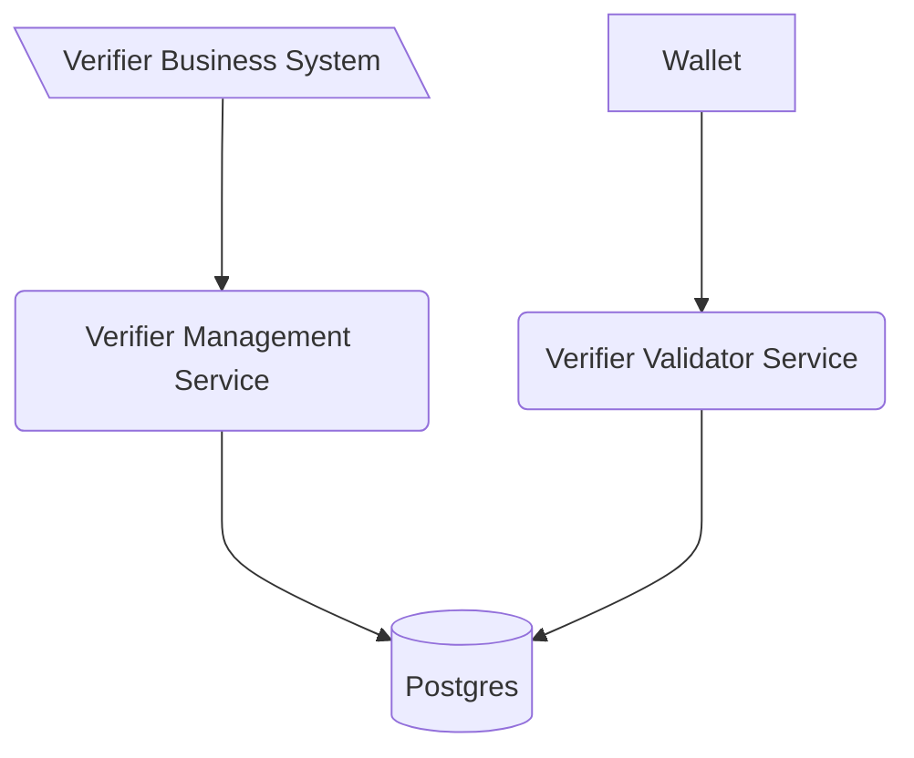

# Generic verifier management service

This software is a web server implementing the technical standards as specified in
the [Swiss E-ID & Trust Infrastructure technical roadmap](https://github.com/e-id-admin/open-source-community/blob/main/tech-roadmap/tech-roadmap.md).
Together with the other generic components provided, this software forms a collection of APIs allowing issuance and
verification of verifiable credentials without the need of reimplementing the standards.

The Generic Verifier Management Service is the interface to start a verification process. The service itself is and
should be only accessible from inside the organization.

As with all the generic issuance & verification services it is expected that every issuer and verifier hosts their own
instance of the service.

The verification management service is linked to the verification validator services through a database, allowing to
scale the validator service independently of the management service.



# Deployment

> Please make sure that you did the following before starting the deployment:
> - Generated the signing keys file with the didtoolbox.jar
> - Generated a DID which is registered on the identifier registry
> - Registered yourself on the swiyuprobeta portal
> - Registered yourself on the api self service portal

##  Third party usage
> Are you a third-party user? Then you're right here! Otherwhise go to [gov internal usage](#Gov-internal-usage)
### Set the environment variables
A sample compose file for an entire setup of both components and a database can be found in [sample.compose.yml](sample.compose.yml) file.
**Replace all placeholder <VARIABLE_NAME>**.

Please be aware that both the verifier-agent-management and the verifier-agent-oid4vci need to be publicly accessible over an domain configured in `EXTERNAL_URL` so that
a wallet can communicate with them.

The latest images are available here:
- [verifier-agent-oid4vci](https://github.com/admin-ch-ssi/mirror-verifier-agent-oid4vp/pkgs/container/mirror-verifier-agent-oid4vp)
- [verifier-agent-management](https://github.com/admin-ch-ssi/mirror-verifier-agent-management/pkgs/container/mirror-verifier-agent-management)

## Gov internal usage
### 1. Setup up infrastructure
When deployed in an RHOS setup the issuer-management / issuer-agent setup need the following setup
#### Database
Single postgresql databse service needs to be available. Make sure that the following bindings exist between your database and the application namespace:
- database -> issuer-verifier-management: Full
- database -> issuer-verifier-oid4vci: Read-Write
#### MAV
The MAV needs to be bound to the application namespace. Make sure the secrets are located in the path **default/application_secrets**
and you configured the vault so that it uses the application_secrets as properties
```yaml
vaultsecrets:
  vaultserver: https://mav.bit.admin.ch
  serviceaccount: default
  cluster: p-szb-ros-shrd-npr-01
  path: default
  properties:
    - application_secrets
``` 
### 2. Set the environment variables
Due to the separation of the secret and non-secret variables the location is split. Make sure that you've set at least the following variables.
Concerning the actual values take a look at the [sample.compose.yml](sample.compose.yml)

| Location                | issuer-agent-management                                                                                    | issuer-agent-oid4vci |
|-------------------------|------------------------------------------------------------------------------------------------------------|----------------------|
| GitOps                  | OID4VP_URL                                                                                                 | EXTERNAL_URL<br/>VERIFIER_DID<br/>DID_VERIFICATION_METHOD<br/>VERIFIER_NAME                     |
| ManagedApplicationVault |  |  SIGNING_KEY                    |


# Development

> Please be aware that this section **focus on the development of the issuer management service**. For the deployment of the
> component please consult [deployment section](#Deployment).

Run the following commands to start the service. This will also spin up a local postgres database from
the docker compose.yml:

```shell
mvn spring-boot:run -Dspring-boot.run.profiles=local # start spring boot java application
```

After the start api definitions can be found [here](http://localhost:8080/swagger-ui/index.html)

## Configuration

### Environment variables

| Variable          | Description                                                                                                                                            | Type         | Default |
|-------------------|--------------------------------------------------------------------------------------------------------------------------------------------------------|--------------|---------|
| OID4VP_URL        | Defines the location (url) of the public facing validator ->  check [verifier-agent-oid4vp](https://github.com/e-id-admin/eidch-verifier-agent-oid4vp) | string (url) | none    |
| POSTGRES_USER     | Username to connect to the Issuer Agent Database shared with the issuer agent managment service                                                        | string       | none    |
| POSTGRES_PASSWORD | Username to connect to the Issuer Agent Database                                                                                                       | string       | none    |
| POSTGRES_URL      | JDBC Connection string to the shared DB                                                                                                                | string       | none    |

## Usage

### Perform a verification

To perform a verification, it is required to first create the request. This is done with the `POST /verifications`
endpoint.
What data is requested can be selected by adding in additional fields only containing "path".
Filters are currently only supported for `$.vct` - the Verifiable Credential Type.
In the following example we request to have the dateOfBirth revealed to us from a Credential with the type "elfa-sdjwt".

```json
{
  "id": "00000000-0000-0000-0000-000000000000",
  "name": "Example Verification",
  "purpose": "We want to test a new Verifier",
  "input_descriptors": [
    {
      "id": "11111111-1111-1111-1111-111111111111",
      "name": "Example Data Request",
      "format": {
        "vc+sd-jwt": {
          "sd-jwt_alg_values": [
            "ES256"
          ],
          "kb-jwt_alg_values": [
            "ES256"
          ]
        }
      },
      "constraints": {
        "fields": [
          {
            "path": [
              "$.vct"
            ],
            "filter": {
              "type": "string",
              "const": "elfa-sdjwt"
            }
          },
          {
            "path": [
              "$.dateOfBirth"
            ]
          }
        ]
      }
    }
  ]
}
```

The response of this post call contains the URI which has to be provided to the holder.

## Contribution

We appreciate feedback and contribution. More information can be found in the [CONTRIBUTING-File](/CONTRIBUTING.md).

## License

This project is licensed under the terms of the MIT license. See the [LICENSE](/LICENSE) file for details.
