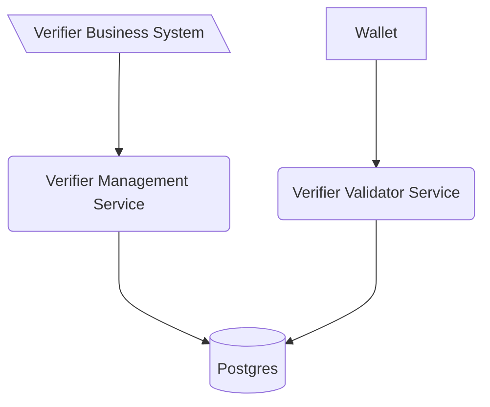

<!--
SPDX-FileCopyrightText: 2025 Swiss Confederation

SPDX-License-Identifier: MIT
-->


# Generic verification service OID4VP

This software is a web server implementing the technical standards as specified in
the [Swiss e-ID and trust infrastructure: Initial implementation](https://swiyu-admin-ch.github.io/initial-technology/).
Together with the other generic components provided, this software forms a collection of APIs allowing issuance and
verification of verifiable credentials without the need of reimplementing the standards.

The Generic Verifier Validator Service is the public facing validator to handle validation with the wallet.

As with all the generic issuance & verification services it is expected that every issuer and verifier hosts their own
instance of the service.

The verification validator service is linked to the verification management services through a database, allowing to
scale every service independently of the management service.

## Table of Contents

- [Overview](#Overview)
- [Deployment](#deployment)
- [Usage](#usage)
- [Development](#development)
- [Contributions and feedback](#contributions-and-feedback)
- [License](#license)

## Overview


# Deployment

For the deployment of the component please
consult [deployment section of the verifier-agent-management](https://github.com/swiyu-admin-ch/eidch-verifier-agent-management)
because it is the main interaction point with the issuer managent/oid4vci bundle

# Usage 

## Codes

### VerificationError
| Value                                     | Description                                                                                                          |
| ----------------------------------------- | -------------------------------------------------------------------------------------------------------------------- |
| invalid_request                           | The request was invalid.<br>This is a general purpose code if none of the other codes apply.                         |
| authorization_request_missing_error_param | During the verification process a required parameter (eg.: vp_token, presentation) was not provided in the request.  |
| authorization_request_object_not_found    | The requested verification process cannot be found.                                                                  |
| verification_process_closed               | The requested verification process is already closed.                                                                |
| invalid_presentation_definition           | The provided credential presentation was invalid.                                                                    |


### VerificationErrorResponseCode
| Value                             | Description                                                                                                                          |
| --------------------------------- | ------------------------------------------------------------------------------------------------------------------------------------ |
| credential_invalid                | The credential presented during validation was deemed invalid.<br>This is a general purpose code if none of the other codes apply.   |
| jwt_expired                       | During the verification process an expired jwt was used.                                                                             |
| missing_nonce                     | During the verification process a nonce was missing.                                                                                 |
| invalid_format                    | The data send in the verification process used an invalid format.                                                                    |
| credential_expired                | The credential presented during validation was expired.                                                                              |
| unsupported_format                | The credential presented during validation was in an unsupported format.                                                             |
| credential_revoked                | The credential presented during validation was revoked.                                                                              |
| credential_suspended              | The credential presented during validation was suspended.                                                                            |
| credential_missing_data           | The credential presented during validation does not contain the required fields.                                                     |
| unresolvable_status_list          | The credential presented during validation contains a status list which cannot be reached during validation.                         |
| public_key_of_issuer_unresolvable | The credential presented during validation was issued by an entity that does not provide the public key at the time of verification. |
| issuer_not_accepted               | The credential presented during validation was issued by an entity that is not in the list of allowed issuers.                       |
| holder_binding_mismatch           | The holder has provided invalid proof that the credential is under their control.                                                    |
| client_rejected                   | The holder rejected the verification request.                                                                                        |


# Development

> Please be aware that this section **focus on the development of the verifier oid4vp service**. For the deployment of the
> component please consult [deployment section of the verifier-agent-management](https://github.com/swiyu-admin-ch/eidch-verifier-agent-management).

## Single service development
Run the following commands to start the service. This will also spin up a local postgres database from
docker-compose.yml:

```shell
mvn spring-boot:run -Dspring-boot.run.profiles=local # start spring boot java application
```

After the start api definitions can be found [here](http://localhost:8080/swagger-ui/index.html#/)

## Integrated service development
The integrated service development describes how to devolp this service together with its management component.  

The management component needs to be started and be fully running before the oid4vp component can be started.  

Run the following commands to start this service.

```shell
mvn spring-boot:run -Dspring-boot.run.profiles=local,local-shared # start spring boot java application
```

After the start api definitions can be found [here](http://localhost:8003/swagger-ui/index.html).

## Configuration

### Generate Keys

Currently only EC 256 keys are used.
Generate private key with:
`openssl ecparam -genkey -name prime256v1 -noout -out ec_private.pem`
Remember to keep private keys private and safe. It should never be transmitted, etc.

On the base registry the public key is published. To generate the public key form the private key we can use
`openssl ec -in private.pem -pubout -out ec_public.pem`

### Configuration Environment Variables

| Variable                    | Description                                                                                                                                                                                                | Type             | Default |
| --------------------------- | ---------------------------------------------------------------------------------------------------------------------------------------------------------------------------------------------------------- | ---------------- | ------- |
| EXTERNAL_URL                | URL of this deployed instance in order to add it to the request                                                                                                                                            | URL              | None    |
| VERIFIER_DID                | DID of this service-instance to identify the requester                                                                                                                                                     | string (did:tdw) | none    |
| DID_VERIFICATION_METHOD     | The full DID with fragment as used to find the public key for sd-jwt VCs in the DID Document. eg: `did:tdw:<base-registry-url>:<issuer_uuid>#<sd-jwt-public-key-fragment>`                                 | string (did:tdw) | none    |
| POSTGRES_USER               | Username to connect to the Issuer Agent Database shared with the issuer agent managment service                                                                                                            | string           | none    |
| POSTGRES_PASSWORD           | Username to connect to the Issuer Agent Database                                                                                                                                                           | string           | none    |
| POSTGRES_JDBC               | JDBC Connection string to the shared DB                                                                                                                                                                    | string           | none    |
| SIGNING_KEY                 | Private Key in PEM format used to sign request objects sent to the holder                                                                                                                                  | string           | none    |
| URL_REWRITE_MAPPING         | Json object for url replacements during rest client call. Key represents the original url and value the one which should be used instead (e.g. {"https://mysample1.ch":"https://somethingdiffeerent1.ch"}) | string           | "{}"    |
| OPENID_CLIENT_METADATA_FILE | Path to the verifier metdata file as shown in the [verifier-agent-management](https://github.com/swiyu-admin-ch/eidch-verifier-agent-management/blob/main/sample.compose.yml) sample                       | string           | None    |

### Kubernetes Vault Keys

| Variable           | Description                                                                                      |
| ------------------ | ------------------------------------------------------------------------------------------------ |
| secret.db.username | Username to connect to the Issuer Agent Database shared with the issuer agent managment service  |
| secret.db.password | Username to connect to the Issuer Agent Database                                                 |
| secret.signing_key | Private Key used to sign the request object sent to the holder - alternative to the env variable |

### HSM - Hardware Security Module

For operations with an HSM, the keys need not be mounted directly into the environment running this application.
Instead, a connection is created to the HSM via JCA. This can be with
the [Sun PKCS11 provider](https://docs.oracle.com/en/java/javase/22/security/pkcs11-reference-guide1.html) or a vendor
specific option.
Note that for creating the keys it is expected that the public key is provided as self-signed certificated.

| Variable                      | Description                                                                                                                                                                                |
| ----------------------------- | ------------------------------------------------------------------------------------------------------------------------------------------------------------------------------------------ |
| SIGNING_KEY_MANAGEMENT_METHOD | This variable serves as selector. `key` is used for a mounted key. `pkcs11` for the sun pkcs11 selector. For vendor specific libraries the project must be compiled with these configured. |
| HSM_HOST                      | URI of the HSM Host or Proxy to be connected to                                                                                                                                            |
| HSM_PORT                      |                                                                                                                                                                                            |
| HSM_USER                      | User for logging in on the host                                                                                                                                                            |
| HSM_PASSWORD                  | Password for logging in to the HSM                                                                                                                                                         |
| HSM_PROXY_USER                |                                                                                                                                                                                            |
| HSM_PROXY_PASSWORD            |                                                                                                                                                                                            |
| HSM_USER_PIN                  | For some proprietary providers required pin                                                                                                                                                |
| HSM_KEY_ID                    | Key identifier or alias, or label when using pkcs11-tool                                                                                                                                   |
| HSM_KEY_PIN                   | Optional pin to unlock the key                                                                                                                                                             |
| HSM_CONFIG_PATH               | File Path to the HSM config file when using [Sun PKCS11 provider](https://docs.oracle.com/en/java/javase/22/security/pkcs11-reference-guide1.html)                                         |
| HSM_USER_PIN                  | PIN for getting keys from the HSM                                                                                                                                                          |

## Contributions and feedback

We appreciate feedback and contribution. More information can be found in the [CONTRIBUTING-File](/CONTRIBUTING.md).

## License

This project is licensed under the terms of the MIT license. See the [LICENSE](/LICENSE) file for details.
