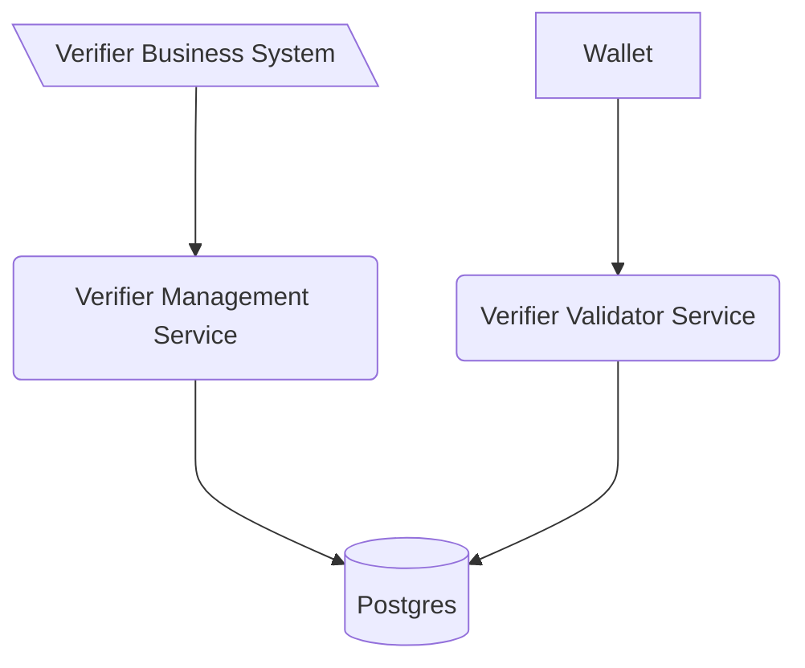

# Verification Management Service

This software is a web server implementing the technical standards as specified in
the [Swiss E-ID & Trust Infrastructure technical roadmap](https://github.com/e-id-admin/open-source-community/blob/main/tech-roadmap/tech-roadmap.md).
Together with the other generic components provided, this software forms a collection of APIs allowing issuance and
verification of verifiable credentials without the need of reimplementing the standards.

The Generic Verifier Management Service is the interface to start a verification process. The service itself is and
should be only accessible from inside the organization.

As with all the generic issuance & verification services it is expected that every issuer and verifier hosts their own
instance of the service.

The verification management service is linked to the verification validator services through a database, allowing to
scale the validator service independently from the management service.

## How to start

## Setup

- Start application VerifierManagementApplication with local profile
    - Starts docker compose for database
    - Runs Flyway migrations if needed
- Api definitions can be found [here](http://localhost:8080/swagger-ui/index.html#/)

## Implementation details

### Environment variables

| Variable         | Description                                                                                                                    | Type          | Default       |
|------------------|--------------------------------------------------------------------------------------------------------------------------------|---------------|---------------|
| verification-ttl | Defines how long the verification will be stored                                                                               | long          | 86400 (60min) |
| oid4vp-url       | Defines the location (url) of the public facing validator ->  check [verifier-agent-oid4vp](https://todo-add-public-link-here) | string  (url) | none          |
