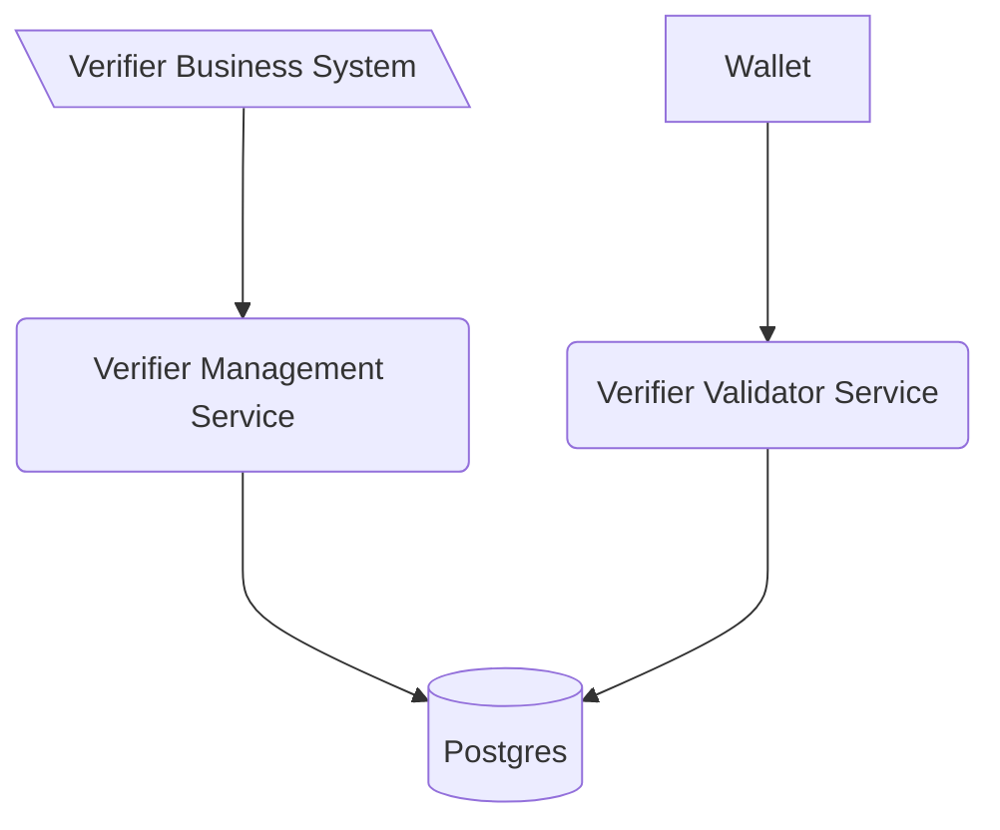

# Verification Management Service

This software is a web server implementing the technical standards as specified in
the [Swiss E-ID & Trust Infrastructure technical roadmap](https://github.com/e-id-admin/open-source-community/blob/main/tech-roadmap/tech-roadmap.md).
Together with the other generic components provided, this software forms a collection of APIs allowing issuance and
verification of verifiable credentials without the need of reimplementing the standards.

The Generic Verifier Management Service is the interface to start a verification process. The service itself is and
should be only accessible from inside the organization.

As with all the generic issuance & verification services it is expected that every issuer and verifier hosts their own
instance of the service.

The verification management service is linked to the verification validator services through a database, allowing to
scale the validator service independently of the management service.



## How to start

## Setup

- Start application VerifierManagementApplication with local profile
    - Starts docker compose for database
    - Runs Flyway migrations if needed
- Api definitions can be found [here](http://localhost:8080/swagger-ui/index.html#/)

or:
Start database with:
```shell
docker compose up --build
```

Run application with:
```shell
mvn spring-boot:run -Dspring-boot.run.profiles=local
```

## Implementation details

### Environment variables

| Variable          | Description                                                                                                                    | Type         | Default       |
|-------------------|--------------------------------------------------------------------------------------------------------------------------------|--------------|---------------|
| OID4VP_URL        | Defines the location (url) of the public facing validator ->  check [verifier-agent-oid4vp](https://github.com/e-id-admin/eidch-verifier-agent-oid4vp) | string (url) | none          |
| POSTGRES_USER     | Username to connect to the Issuer Agent Database shared with the issuer agent managment service                                | string       | none          |
| POSTGRES_PASSWORD | Username to connect to the Issuer Agent Database                                                                               | string       | none          |
| POSTGRES_URL      | JDBC Connection string to the shared DB                                                                                        | string       | none          |

## Usage
### Perform a verification
To perform a verification, it is required to first create the request. This is done with the `POST /verifications` endpoint.
What data is requested can be selected by adding in additional fields only containing "path".
Filters are currently only supported for `$.vct` - the Verifiable Credential Type.
In the following example we request to have the dateOfBirth revealed to us from a Credential with the type "elfa-sdjwt". 
```json
{
    "id": "00000000-0000-0000-0000-000000000000",
    "name":"Example Verification",
    "purpose":"We want to test a new Verifier",
    "input_descriptors":[{
        "id": "11111111-1111-1111-1111-111111111111",
        "name": "Example Data Request",
        "format": {"vc+sd-jwt": {"sd-jwt_alg_values":["ES256"], "kb-jwt_alg_values":["ES256"]}},
        "constraints":{
            "fields":[
                {
                    "path": ["$.vct"],
                    "filter":{
                        "type": "string",
                        "const":"elfa-sdjwt"
                        }
                },
                {
                "path":["$.dateOfBirth"]
            }]
        }
    }]
}
```

The response of this post call contains the URI which has to be provided to the holder.

## Contribution

We appreciate feedback and contribution. More information can be found in the [CONTRIBUTING-File](/CONTRIBUTING.md).

## License

This project is licensed under the terms of the MIT license. See the [LICENSE](/LICENSE) file for details.
