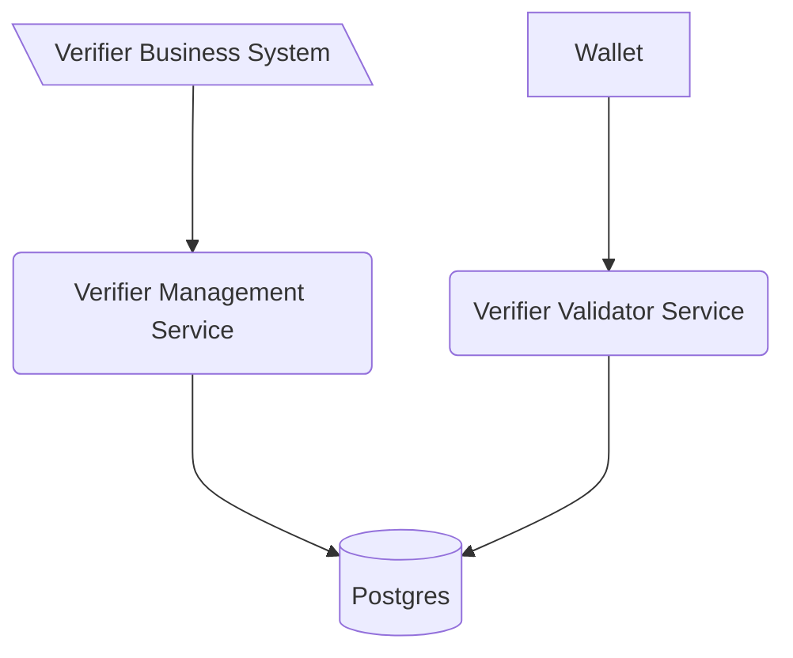

# Generic verification service OID4VP

This software is a web server implementing the technical standards as specified in
the [Swiss E-ID & Trust Infrastructure technical roadmap](https://github.com/e-id-admin/open-source-community/blob/main/tech-roadmap/tech-roadmap.md).
Together with the other generic components provided, this software forms a collection of APIs allowing issuance and
verification of verifiable credentials without the need of reimplementing the standards.

The Generic Verifier Validator Service is the public facing validator to handle validation with the wallet.

As with all the generic issuance & verification services it is expected that every issuer and verifier hosts their own
instance of the service.

The verification validator service is linked to the verification management services through a database, allowing to
scale every service independently of the management service.


# Deployment
For the deployment of the component please consult [deployment section of the verifier-agent-management](https://bitbucket.bit.admin.ch/projects/EID/repos/verifier-agent-management/browse)
because it is the main interaction point with the issuer managent/oid4vci bundle

# Development

> Please be aware that this section **focus on the development of the verifier oid4vp service**. For the deployment of the
> component please consult [deployment section of the verifier-agent-management](https://bitbucket.bit.admin.ch/projects/EID/repos/verifier-agent-management/browse).

## Single service development
Run the following commands to start the service. This will also spin up a local postgres database from
docker-compose.yml:

```shell
mvn spring-boot:run -Dspring-boot.run.profiles=local # start spring boot java application
```

After the start api definitions can be found [here](http://localhost:8080/swagger-ui/index.html#/)

## Integrated service development
The integrated service development describes how to devolp this service together with its management component.  

The managment component needs to be started and be fully running before the oid4vp component can be started.  

Run the following commands to start this service.

```shell
mvn spring-boot:run -Dspring-boot.run.profiles=local,local-shared # start spring boot java application
```

After the start api definitions can be found [here](http://localhost:8003/swagger-ui/index.html).

## Configuration

### Environment variables

| Variable            | Description                                                                                                                                                                                                | Type             | Default |
|---------------------|------------------------------------------------------------------------------------------------------------------------------------------------------------------------------------------------------------|------------------|---------|
| EXTERNAL_URL        | URL of this deployed instance in order to add it to the request                                                                                                                                            | URL              | None    |
| VERIFIER_DID        | DID of this service-instance to identify the requester                                                                                                                                                     | string (did:tdw) | none    |
| VERIFIER_NAME       | Client name which is included in the verification request as part of the metadata                                                                                                                          | string           | None    |
| VERIFIER_LOGO       | Client logo uri which is included in the verification request as part of the metadata                                                                                                                      | string           | None    |
| POSTGRES_USER       | Username to connect to the Issuer Agent Database shared with the issuer agent managment service                                                                                                            | string           | none    |
| POSTGRES_PASSWORD   | Username to connect to the Issuer Agent Database                                                                                                                                                           | string           | none    |
| POSTGRES_URL        | JDBC Connection string to the shared DB                                                                                                                                                                    | string           | none    |
| SIGNING_KEY         | Private Key in PEM format used to sign request objects sent to the holder                                                                                                                                  | string           | none    |
| URL_REWRITE_MAPPING | Json object for url replacements during rest client call. Key represents the original url and value the one which should be used instead (e.g. {"https://mysample1.ch":"https://somethingdiffeerent1.ch"}) | string           | "{}"    |

### Kubernetes Vault Keys

| Variable           | Description                                                                                      |
|--------------------|--------------------------------------------------------------------------------------------------|
| secret.db.username | Username to connect to the Issuer Agent Database shared with the issuer agent managment service  |
| secret.db.password | Username to connect to the Issuer Agent Database                                                 |
| secret.signing_key | Private Key used to sign the request object sent to the holder - alternative to the env variable | 

## Contribution

We appreciate feedback and contribution. More information can be found in the [CONTRIBUTING-File](/CONTRIBUTING.md).

## License

This project is licensed under the terms of the MIT license. See the [LICENSE](/LICENSE) file for details.
