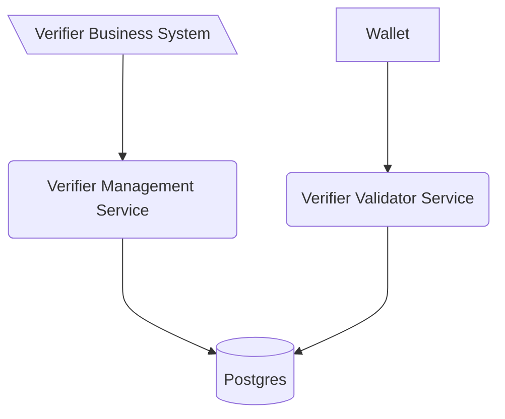

<!--
SPDX-FileCopyrightText: 2025 Swiss Confederation

SPDX-License-Identifier: MIT
-->


// TODO gapa: merge the readme files into one, and remove the duplicated content

# Generic Verifier Management & Validator Services

This project combines two essential components of the Swiss e-ID trust infrastructure:

* **Verifier Management Service (OID4VCI)**: Manages the initiation of verification processes. Should only be accessible internally.
* **Verifier Validator Service (OID4VP)**: Public-facing service that handles the actual validation with the wallet.

Together, they implement the technical standards from the [Swiss e-ID and trust infrastructure: Initial implementation](https://swiyu-admin-ch.github.io/initial-technology/), allowing issuance and verification of verifiable credentials without reimplementing the standards.

Each verifier is expected to host their own instance of these services. The services communicate via a shared database and are designed to be scalable independently.

## Table of Contents

* [Overview](#overview)
* [Deployment](#deployment)
* [Usage](#usage)
* [Development](#development)
* [Configuration](#configuration)
* [Contributions and feedback](#contributions-and-feedback)
* [License](#license)

## Overview



## Deployment

Please ensure the following before deployment:

* Signing keys generated with `didtoolbox.jar`
* DID registered on the identifier registry
* Registration on the [swiyuprobeta portal](https://swiyu-admin-ch.github.io/)
* Registration on the API self-service portal

> For third-party users, continue here. For government internal usage, see [gov README](gov.README).

Use the [sample.compose.yml](sample.compose.yml) file for reference. Replace all placeholders like `<VARIABLE_NAME>`. The `verifier metadata` in this file must reflect your use case.

Ensure both services are accessible over the domain set in `EXTERNAL_URL`.

## Usage

### Creating and Performing a Verification

To create a verification, first define a `presentation_definition`. Then create a verification request:

```bash
curl -X 'POST' \
  'https://<EXTERNAL_URL verifier-agent-management>/verifications' \
  -H 'accept: */*' \
  -H 'Content-Type: application/json' \
  -d '{ ... }'
```

The response includes a `verification_url` to be shared with the holder.

### Example Input Descriptor

```json
{
    "id": "00000000-0000-0000-0000-000000000000",
    "name": "Example Verification",
    "purpose": "Testing",
    "input_descriptors": [
        {
            "id": "11111111-1111-1111-1111-111111111111",
            "format": {
                "vc+sd-jwt": {
                    "sd-jwt_alg_values": ["ES256"],
                    "kb-jwt_alg_values": ["ES256"]
                }
            },
            "constraints": {
                "fields": [
                    { "path": ["$.vct"], "filter": {"type": "string", "const": "test-sdjwt"} },
                    { "path": ["$.dateOfBirth"] }
                ]
            }
        }
    ]
}
```

### VerificationError Codes

#### `VerificationError`

| Value                                         | Description                                |
| --------------------------------------------- | ------------------------------------------ |
| invalid\_request                              | The request was invalid.                   |
| authorization\_request\_missing\_error\_param | Required parameter missing in the request. |
| authorization\_request\_object\_not\_found    | Requested verification not found.          |
| verification\_process\_closed                 | The verification process is closed.        |
| invalid\_presentation\_definition             | Invalid presentation provided.             |

#### `VerificationErrorResponseCode`

| Value                                 | Description                          |
| ------------------------------------- | ------------------------------------ |
| credential\_invalid                   | Credential deemed invalid.           |
| jwt\_expired                          | JWT used is expired.                 |
| missing\_nonce                        | Nonce missing in request.            |
| invalid\_format                       | Data format is invalid.              |
| credential\_expired                   | Credential is expired.               |
| unsupported\_format                   | Format not supported.                |
| credential\_revoked                   | Credential is revoked.               |
| credential\_suspended                 | Credential is suspended.             |
| credential\_missing\_data             | Missing required data in credential. |
| unresolvable\_status\_list            | Status list unreachable.             |
| public\_key\_of\_issuer\_unresolvable | Issuer public key unavailable.       |
| issuer\_not\_accepted                 | Issuer is not accepted.              |
| holder\_binding\_mismatch             | Proof of holder binding is invalid.  |
| client\_rejected                      | Holder rejected the request.         |

## Development

### Single Service

Run locally with Postgres:

```bash
mvn spring-boot:run -Dspring-boot.run.profiles=local
```

APIs available at:

* Validator: [http://localhost:8080/swagger-ui/index.html](http://localhost:8080/swagger-ui/index.html)
* Manager: [http://localhost:8002/swagger-ui/index.html](http://localhost:8002/swagger-ui/index.html)

### Integrated Services

Start management first, then validator:

```bash
mvn spring-boot:run -Dspring-boot.run.profiles=local,local-shared
```

### OpenAPI Generation

```bash
mvn verify -P generate-doc
```

## Configuration

### Shared Environment Variables

| Variable           | Description            | Type   | Default |
| ------------------ | ---------------------- | ------ | ------- |
| POSTGRES\_USER     | DB username            | string | -       |
| POSTGRES\_PASSWORD | DB password            | string | -       |
| POSTGRES\_JDBC     | JDBC connection string | string | -       |

### Verifier Management Specific

| Variable                           | Description                                             |   |
| ---------------------------------- | ------------------------------------------------------- | - |
| OID4VP\_URL                        | URL of the validator service                            |   |
| VERIFICATION\_TTL\_SEC             | Verification validity period (default 900s)             |   |
| DATA\_CLEAR\_PROCESS\_INTERVAL\_MS | Interval for clearing expired offers (default 420000ms) |   |
| MONITORING\_BASIC\_AUTH\_ENABLED   | Enable basic auth for Prometheus                        |   |
| STAGE                              | Deployment stage                                        |   |

### Verifier Validator Specific

| Variable                       | Description                  |
| ------------------------------ | ---------------------------- |
| EXTERNAL\_URL                  | External URL of the service  |
| VERIFIER\_DID                  | DID of the verifier instance |
| DID\_VERIFICATION\_METHOD      | Full DID with fragment       |
| SIGNING\_KEY                   | Signing key PEM              |
| URL\_REWRITE\_MAPPING          | JSON mapping for URL rewrite |
| OPENID\_CLIENT\_METADATA\_FILE | Path to metadata file        |

### Kubernetes Vault Keys

| Variable            | Description          |
| ------------------- | -------------------- |
| secret.db.username  | Vault DB username    |
| secret.db.password  | Vault DB password    |
| secret.signing\_key | Signing key in vault |

### HSM Configuration

| Variable                                             | Description                        |
| ---------------------------------------------------- | ---------------------------------- |
| SIGNING\_KEY\_MANAGEMENT\_METHOD                     | Method selector: `key`, `pkcs11`   |
| HSM\_HOST, HSM\_PORT, HSM\_USER, HSM\_PASSWORD, etc. | HSM specific credentials and paths |

## Contributions and feedback

We appreciate feedback and contributions. See [CONTRIBUTING.md](/CONTRIBUTING.md) for more.

## License

This project is licensed under the MIT License. See [LICENSE](/LICENSE) for details.
