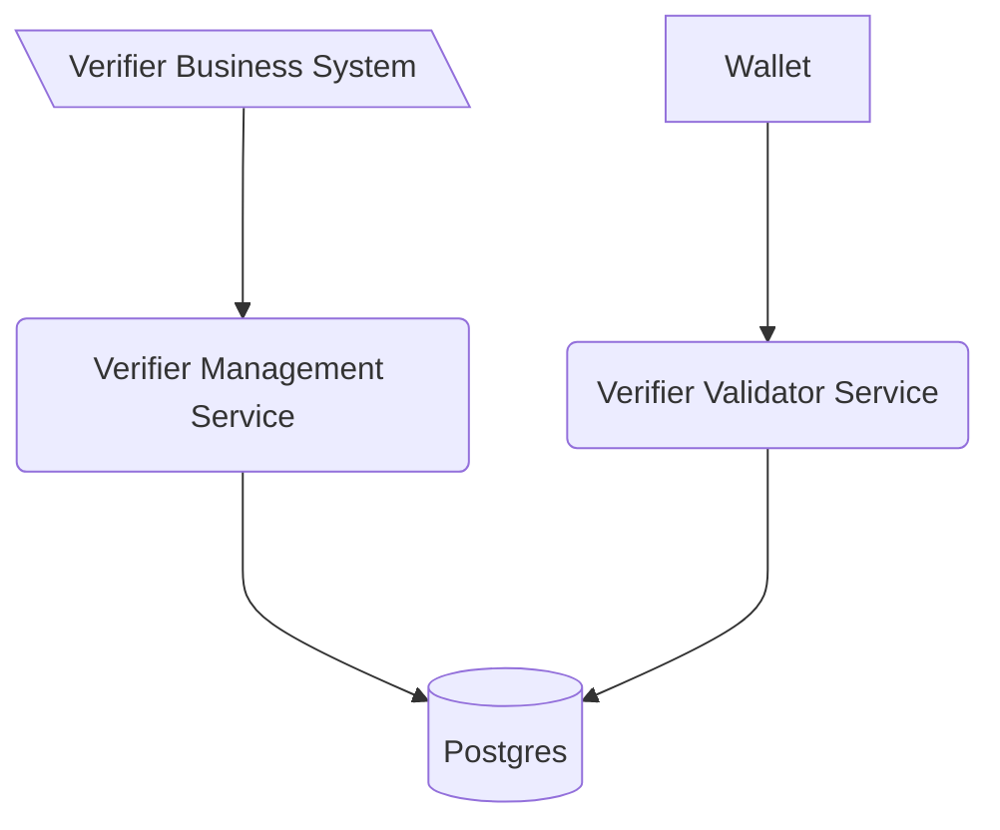

# Verification Validator Service

This software is a web server implementing the technical standards as specified in
the [Swiss E-ID & Trust Infrastructure technical roadmap](https://github.com/e-id-admin/open-source-community/blob/main/tech-roadmap/tech-roadmap.md).
Together with the other generic components provided, this software forms a collection of APIs allowing issuance and
verification of verifiable credentials without the need of reimplementing the standards.

The Generic Verifier Validator Service is the public facing validator to handle validation with the wallet.

As with all the generic issuance & verification services it is expected that every issuer and verifier hosts their own
instance of the service.

The verification validator service is linked to the verification management services through a database, allowing to
scale every service independently from the management service.

## How to start

## Setup

- Start application VerifierManagementApplication with local profile
    - Starts docker compose for database
    - Runs Flyway migrations if needed
- Api definitions can be found [here](http://localhost:8080/swagger-ui/index.html#/)

## Implementation details

### Environment variables

| Variable                      | Description                                                                                     | Type                | Default |
|-------------------------------|-------------------------------------------------------------------------------------------------|---------------------|---------|
| external-url                  | URL of this deployed instance in order to add it to the request                                 | URL                 | None    |
| client_id                     | DID of this service-instance to identify the requester                                          | string (did:tdw)    | none    |
| client_id_scheme              | DID of this service-instance to identify the requester                                          | string              | "did"   |
| client_name                   | Client name which is included in the verification request as part of the metadata               | string              | None    |
| logo_uri                      | Client logo uri which is included in the verification request as part of the metadata           | string              | None    |
| (key.bbs.)seed                | Seed to generate the bbs key from [bbs-library](https://todo-path-to-lib)                       | string              | None    |
| (key.bbs.)verification-method | TODO: Check why                                                                                 | string              | None    |
| (key.sdjwt.)public_key        | Temporary variable to insert the public key for sdjwt -> should be replaced by registries calls | string (pem-foramt) | none    |

## Contribution

We appreciate feedback and contribution. More information can be found in the [CONTRIBUTING-File](/CONTRIBUTING.md).

## License

This project is licensed under the terms of the MIT license. See the [LICENSE](/LICENSE) file for details.