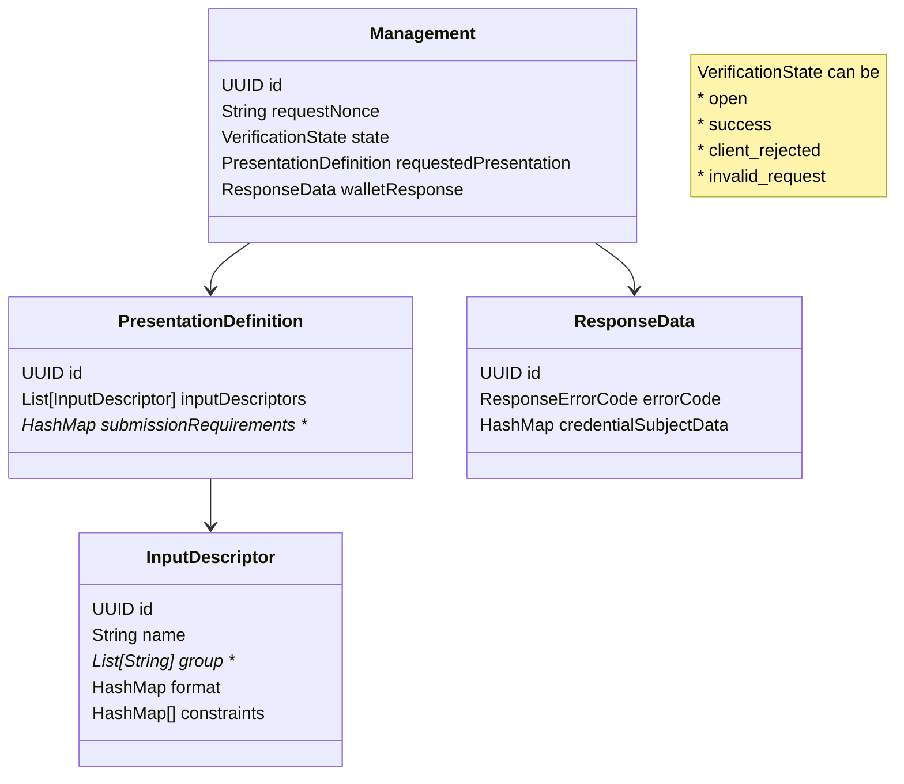

# Generic Issuer OID4VCI service


## Verifier Data

For errorCode see: https://confluence.bit.admin.ch/display/EIDTEAM/Verifier+Specs

** Out of scope Public Beta

## Setup
BIT Development VM:

Change `~/.m2/settings.xml` to include github & public maven repo  
```xml
<?xml version="1.0" encoding="UTF-8"?>

<settings xmlns="http://maven.apache.org/SETTINGS/1.0.0"
          xmlns:xsi="http://www.w3.org/2001/XMLSchema-instance"
          xsi:schemaLocation="http://maven.apache.org/SETTINGS/1.0.0 http://maven.apache.org/xsd/settings-1.0.0.xsd">

    <mirrors>
        <mirror>
            <id>bit-nexus</id>
            <url>https://repo.bit.admin.ch/repository/maven-public/</url>
            <mirrorOf>central</mirrorOf>
        </mirror>
    </mirrors>

    <proxies>
        <proxy>
            <host>proxy-bvcol.admin.ch</host>
            <port>8080</port>
        </proxy>
    </proxies>

  <profiles>
    <profile>
      <id>bit-profile</id>
      <activation>
        <activeByDefault>true</activeByDefault>
      </activation>
      <properties>
        <http_proxy>${env.http_proxy}</http_proxy>
        <https_proxy>${env.https_proxy}</https_proxy>
        <no_proxy>${env.no_proxy}</no_proxy>
      </properties>
      <repositories>
        <repository>
          <id>central</id>
          <name>Nexus Managed Repository</name>
          <url>https://repo.bit.admin.ch/repository/maven-public/</url>
          <releases>
            <enabled>true</enabled>
          </releases>
          <snapshots>
            <enabled>true</enabled>
          </snapshots>
        </repository>
        <repository>
          <id>github</id>
          <url>https://maven.pkg.github.com/admin-ch-ssi/SSI_bbs-cryptosuite-kotlin</url>
          <snapshots>
            <enabled>true</enabled>
          </snapshots>
        </repository>
        <repository>
          <id>maven</id>
          <url>https://repo.maven.apache.org/maven2/</url>
          <snapshots><enabled>true</enabled></snapshots>
        </repository>
      </repositories>
      <pluginRepositories>
        <pluginRepository>
          <id>central</id>
          <name>Nexus Managed Plugin Repository</name>
          <url>https://repo.bit.admin.ch/repository/maven-public/</url>
          <releases>
            <enabled>true</enabled>
          </releases>
          <snapshots>
            <enabled>true</enabled>
          </snapshots>
        </pluginRepository>
        <pluginRepository>
          <id>maven</id>
          <name>Maven Repository</name>
          <url>https://repo.maven.apache.org/maven2/</url>
          <releases>
            <enabled>true</enabled>
          </releases>
          <snapshots>
            <enabled>true</enabled>
          </snapshots>
        </pluginRepository>
      </pluginRepositories>
    </profile>
  </profiles>

  <servers>
        <server>
            <id>github</id>
            <username><!--your github user account (email)--></username>
            <password><!--your github user token (not password!)--></password>
        </server>
    </servers>
</settings>
```


- Start application Oid4vciApplication with local profile
  - Starts docker compose for database
  - Runs Flyway migrations if needed
- Api definitions can be found [here](http://localhost:8080/swagger-ui/index.html#/)