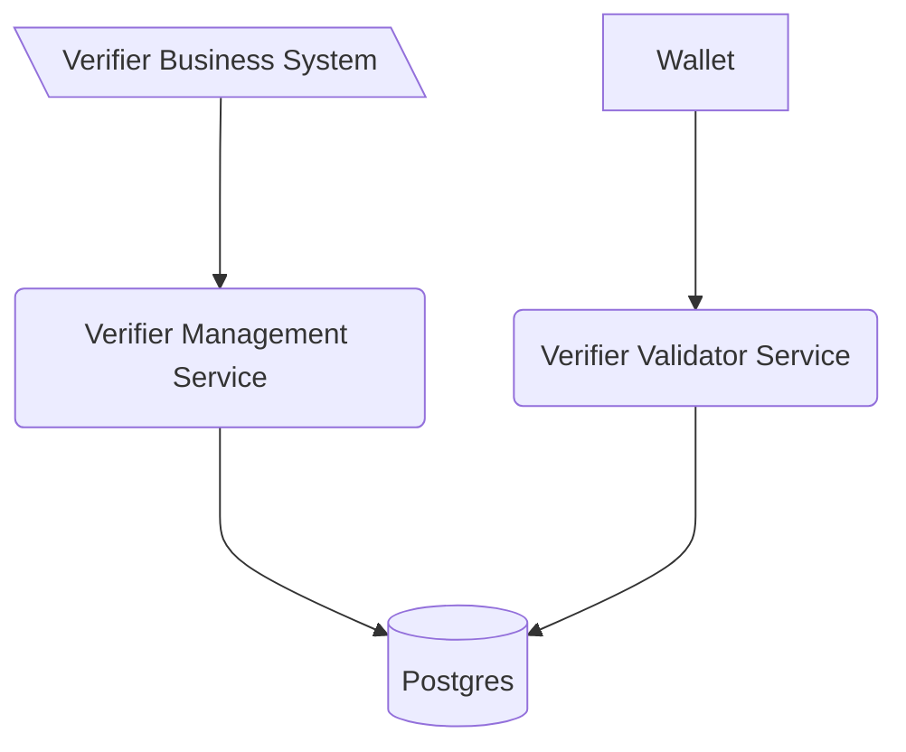

<!--
SPDX-FileCopyrightText: 2025 Swiss Confederation

SPDX-License-Identifier: MIT
-->


# Generic verifier management service

This software is a web server implementing the technical standards as specified in
the [Swiss e-ID and trust infrastructure: Initial implementation](https://swiyu-admin-ch.github.io/initial-technology/).
Together with the other generic components provided, this software forms a collection of APIs allowing issuance and
verification of verifiable credentials without the need of reimplementing the standards.

The Generic Verifier Management Service is the interface to start a verification process. The service itself is and
should be only accessible from inside the organization.

As with all the generic issuance & verification services it is expected that every issuer and verifier hosts their own
instance of the service.

The verification management service is linked to the verification validator services through a database, allowing to
scale the validator service independently of the management service.

## Table of Contents

-   [Overview](#Overview)
-   [Deployment](#deployment)
-   [Development](#development)
-   [Usage](#usage)
-   [Contributions and feedback](#contributions-and-feedback)
-   [License](#license)

## Overview



# Deployment

> Please make sure that you did the following before starting the deployment:
>
> -   Generated the signing keys file with the didtoolbox.jar
> -   Generated a DID which is registered on the identifier registry
> -   Registered yourself on the swiyuprobeta portal
> -   Registered yourself on the api self service portal

> Are you a third-party user? Then you're right here! Otherwhise go to [gov internal usage](gov.REAMDE.md)

## 1. Set the environment variables

A sample compose file for an entire setup of both components and a database can be found
in [sample.compose.yml](sample.compose.yml) file.
**Replace all placeholder <VARIABLE_NAME>**. In addition to that you need to adapt
the [verifier metadata](sample.compose.yml#L35) to your use case.
Those information will be provided to the holder on a dedicated endpoint serving as metadata information of your
verifier.
The placeholder `${CLIENT_ID}` in your metadata file will be replaced on the fly by the value set for `VERIFIER_DID`.

Please be aware that both the verifier-agent-management and the verifier-agent-oid4vci need to be publicly accessible
over a domain configured in `EXTERNAL_URL` so that
a wallet can communicate with them.

## 2. Creating a verification

> For a detailled understanding of the verfication process and the data structure of verification please consult the
> [DIF presentation exchange specification](https://identity.foundation/presentation-exchange/#presentation-definition).
> For more information on the general verification flow consult
> the [OpenID4VP specification](https://openid.net/specs/openid-4-verifiable-presentations-1_0-20.html)

Once the components are deployed cou can create your first verification. For this you first need to define a
presentation
definition. Based on that definition you can then create a verification request for a holder as shown in the example
below.
In this case we're asking for a credential called "my-custom-vc" which should at least have the attributes
firstName and lastName. The following request can be performed by using the swagger endpoint on https://<EXTERNAL_URL of
verifier-agent-management>**/swagger-ui/index.html**

**Request**

```bash
curl -X 'POST' \
  'https://<EXTERNAL_URL verification agent management>/verifications' \
  -H 'accept: */*' \
  -H 'Content-Type: application/json' \
  -d '{
  "presentation_definition": {
    "id": "00000000-0000-0000-0000-000000000000",
    "name": "Test Verification",
    "purpose": "We want to test a new Verifier",
    "format": {
      "vc+sd-jwt": {
        "sd-jwt_alg_values": [
          "ES256"
        ],
        "kb-jwt_alg_values": [
          "ES256"
        ]
      }
    },
    "input_descriptors": [
      {
        "id": "my-custom-vc",
        "name": "Custom VC",
        "purpose": "DEMO vc",
        "format": {
          "vc+sd-jwt": {
            "sd-jwt_alg_values": [
              "ES256"
            ],
            "kb-jwt_alg_values": [
              "ES256"
            ]
          }
        },
        "constraints": {
          "fields": [
            {
              "path": [
                "$.credentialSubject.firstName",
                "$.credentialSubject.lastName"
              ]
            }
          ]
        }
      }
    ]
  }
}'
```

**Response**

The response contains a verification_url which points to verification request just created. This link needs to be
provided to the holder
in order to submit an response to the verification request.

```json
{
  ...
  "verification_url": "https://<EXTERNAL_URL verifieri agent oid4vp>/request-object/fc884edd-7667-49e3-b961-04a98e7b5600"
}
```

# Development

> Please be aware that this section **focus on the development of the issuer management service**. For the deployment of
> the
> component please consult [deployment section](#Deployment).

## Single service development

Run the following commands to start the service. This will also spin up a local postgres database from
the docker compose.yml:

```shell
mvn spring-boot:run -Dspring-boot.run.profiles=local # start spring boot java application
```

After the start api definitions can be found [here](http://localhost:8080/swagger-ui/index.html)

## Integrated service development

The integrated service development describes how to devolp this service together with its oid4pv component.

The managment component needs to be started and be fully running before the oid4vp component can be started.

Run the following commands to start this service. This will also spin up a local postgres database from
the docker compose.yml:

```shell
mvn spring-boot:run -Dspring-boot.run.profiles=local,local-shared # start spring boot java application
```

After the start api definitions can be found [here](http://localhost:8002/swagger-ui/index.html).

## Configuration

### Environment variables

| Variable                       | Description                                                                                                                                               | Type         | Default |
| ------------------------------ | --------------------------------------------------------------------------------------------------------------------------------------------------------- | ------------ | ------- |
| OID4VP_URL                     | Defines the location (url) of the public facing validator -> check [verifier-agent-oid4vp](https://github.com/swiyu-admin-ch/eidch-verifier-agent-oid4vp) | string (url) | none    |
| POSTGRES_USER                  | Username to connect to the Issuer Agent Database shared with the issuer agent managment service                                                           | string       | none    |
| POSTGRES_PASSWORD              | Username to connect to the Issuer Agent Database                                                                                                          | string       | none    |
| POSTGRES_JDBC                  | JDBC Connection string to the shared DB                                                                                                                   | string       | none    |
| VERIFICATION_TTL_SEC           | Validity period in seconds of an verification offer                                                                                                       | int          | 900     |
| DATA_CLEAR_PROCESS_INTERVAL_MS | Inverval in which expired offers should be removed from cache in milliseconds.                                                                            | int          | 420000  |
| MONITORING_BASIC_AUTH_ENABLED  | Enables basic auth protection of the /actuator/prometheus endpoint. (Default: false)                                                                      |
| MONITORING_BASIC_AUTH_USERNAME | Sets the username for the basic auth protection of the /actuator/prometheus endpoint.                                                                     |
| MONITORING_BASIC_AUTH_PASSWORD | Sets the password for the basic auth protection of the /actuator/prometheus endpoint.                                                                     |
| STAGE                          | Sets the profiles for the images in the entrypoint file.                                                                                                  |

## Usage

### Perform a verification

To perform a verification, it is required to first create the request. This is done with the `POST /verifications`
endpoint.
What data is requested can be selected by adding in additional fields only containing "path".
Filters are currently only supported for `$.vct` - the Verifiable Credential Type.
In the following example we request to have the dateOfBirth revealed to us from a Credential with the type "test-sdjwt".

```json
{
    "id": "00000000-0000-0000-0000-000000000000",
    "name": "Example Verification",
    "purpose": "We want to test a new Verifier",
    "input_descriptors": [
        {
            "id": "11111111-1111-1111-1111-111111111111",
            "name": "Example Data Request",
            "format": {
                "vc+sd-jwt": {
                    "sd-jwt_alg_values": ["ES256"],
                    "kb-jwt_alg_values": ["ES256"]
                }
            },
            "constraints": {
                "fields": [
                    {
                        "path": ["$.vct"],
                        "filter": {
                            "type": "string",
                            "const": "test-sdjwt"
                        }
                    },
                    {
                        "path": ["$.dateOfBirth"]
                    }
                ]
            }
        }
    ]
}
```

The response of this post call contains the URI which has to be provided to the holder.

### Codes

#### VerificationErrorResponseCode

| Value                             | Description                                                                                                                          |
| --------------------------------- | ------------------------------------------------------------------------------------------------------------------------------------ |
| credential_invalid                | The credential presented during validation was deemed invalid.<br>This is a general purpose code if none of the other codes apply.   |
| jwt_expired                       | During the verification process an expired jwt was used.                                                                             |
| missing_nonce                     | During the verification process a nonce was missing.                                                                                 |
| invalid_format                    | The data send in the verification process used an invalid format.                                                                    |
| credential_expired                | The credential presented during validation was expired.                                                                              |
| unsupported_format                | The credential presented during validation was in an unsupported format.                                                             |
| credential_revoked                | The credential presented during validation was revoked.                                                                              |
| credential_suspended              | The credential presented during validation was suspended.                                                                            |
| credential_missing_data           | The credential presented during validation does not contain the required fields.                                                     |
| unresolvable_status_list          | The credential presented during validation contains a status list which cannot be reached during validation.                         |
| public_key_of_issuer_unresolvable | The credential presented during validation was issued by an entity that does not provide the public key at the time of verification. |
| issuer_not_accepted               | The credential presented during validation was issued by an entity that is not in the list of allowed issuers.                       |
| holder_binding_mismatch           | The holder has provided invalid proof that the credential is under their control.                                                    |
| client_rejected                   | The holder rejected the verification request.                                                                                        |

## Contributions and feedback

The code for this repository is developed privately and will be released after each sprint. The published code can
therefore only be a snapshot of the current development and not a thoroughly tested version. However, we welcome any
feedback on the code regarding both the implementation and security aspects. Please follow the guidelines for
contributing found in [CONTRIBUTING.md](/CONTRIBUTING.md).

## License

This project is licensed under the terms of the MIT license. See the [LICENSE](/LICENSE) file for details.
