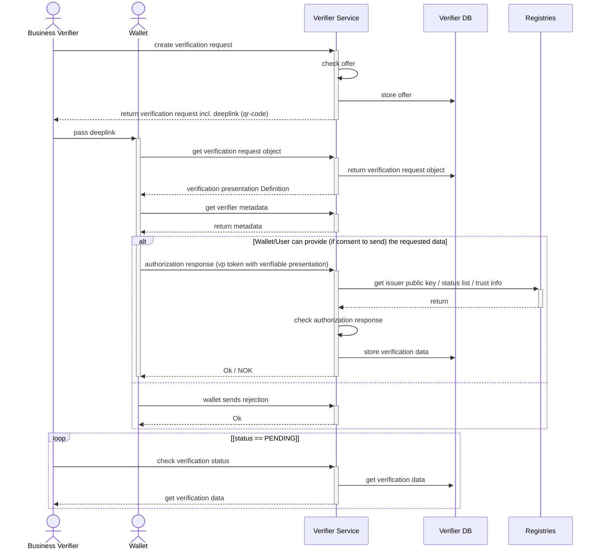

# Verification Process Details

This document provides insights about the verification V1 process and how to securely use a verification process.

## Overview of the Verification V1 process

> [!NOTE]  
> Please note that this is a simplified overview of the process used to show the interactions between the involved parties (specially between the Verifier Service and the Wallet).
> Internal Wallet operations (like user authentication, user consent, etc.) are not shown in this diagram, also the interactions with the Registries are simplified.



Certainly! Here is the README documentation with example `curl` requests in Markdown syntax.  
All code blocks and sections use proper Markdown formatting.

# OID4VP Verifier API - Example Requests

> [!NOTE]  
> All calls use the localhost server at port 8083, which can be started with the sample-compose file [how to get started]().
> Adjust the URL as needed if you deployed the service elsewhere.

> [!NOTE]  
> This call works with the current version of the Beta-ID.

## Business Verifier Interactions

The Business Verifier exclusively uses the management api endpoints provided under `/management/api/`.

### 1. Create Verification

> [!IMPORTANT]  
> The example above is only a bare minimum working example. In a production scenario, you should at least set the `accepted_issuer_dids` or `trust_anchors` which are described below.

**Basic Request:**
```bash
curl -X POST \
  -H "Content-Type: application/json" \
  -d '{
    "accepted_issuer_dids": [
        "<Your ISSUER_DID>"
    ],
    "presentation_definition": {
        "id": "00000000-0000-0000-0000-000000000000",
        "input_descriptors": [
            {
                "id": "11111111-1111-1111-1111-111111111111",
                "format": {
                    "vc+sd-jwt": {
                        "sd-jwt_alg_values": [
                            "ES256"
                        ],
                        "kb-jwt_alg_values": [
                            "ES256"
                        ]
                    }
                },
                "constraints": {
                    "fields": [
                        {
                            "path": [
                                "$.vct"
                            ],
                            "filter": {
                                "type": "string",
                                "const": "betaid-sdjwt"
                            }
                        },
                        {
                            "path": [
                                "$.age_over_18"
                            ]
                        }
                    ]
                }
            }
        ]
    }
}' \
http://localhost:8083/management/api/verifications
```

To limit the accepted issuers, you can set the `accepted_issuer_dids` parameter with a list of trusted issuer DIDs. 
Otherwise, any credential that provides the requested claims will be accepted an example here is:
```json
{
    "...": "...",
    "accepted_issuer_dids": [
        "Your ISSUER_DID"
    ]
}
```
Alternatively, you can set the `trust_anchors` parameter to restrict the accepted issuers to those issued by trusted from the trust-registry.
List of trust anchor dids from the trust registry.
```json
{
    "...": "...",
    "trust_anchors": [
        "YOUR-TRUST-REGISTRY-ENTRY-DID"
    ]
}
```

**Response:**

> [!NOTE]  
> Please store the `id` field from the response, as it is needed for further interactions. And will be used as `${VERIFICATION_ID}` in the following examples.
> The `verification_deeplink` can be used to create a QR code, which must then be provided to the wallet (must be done by the business verifier).

```json
{
    "id": "${VERIFICATION_ID}",
    "request_nonce": "a-nonce",
    "state": "PENDING",
    "presentation_definition": {
        "id": "00000000-0000-0000-0000-000000000000",
        "input_descriptors": [
            {
                "id": "11111111-1111-1111-1111-111111111111",
                "format": {
                    "vc+sd-jwt": {
                        "sd-jwt_alg_values": [
                            "ES256"
                        ],
                        "kb-jwt_alg_values": [
                            "ES256"
                        ]
                    }
                },
                "constraints": {
                    "fields": [
                        {
                            "path": [
                                "$.vct"
                            ],
                            "filter": {
                                "type": "string",
                                "const": "betaid-sdjwt"
                            }
                        },
                        {
                            "path": [
                                "$.age_over_18"
                            ]
                        }
                    ]
                }
            }
        ]
    },
    "verification_url": "https://<external url of this service>/oid4vp/api/request-object/${REQUEST_ID}",
    "verification_deeplink": "swiyu-verify://?client_id=..."
}
```

### 2. Get Verification by ID

Returns the current status and provided data of a verification request to the business verifier.

**Request:**
```bash
curl -X GET \
  -H "Accept: application/json" \
  http://localhost:8083/management/api/verifications/${VERIFICATION_ID}
```

**Response:**
```json
{
    "id": "${VERIFICATION_ID}",
    "request_nonce": "a-nonce",
    "state": "PENDING",
    "presentation_definition": {
        "id": "00000000-0000-0000-0000-000000000000",
        "input_descriptors": [
            {
                "id": "11111111-1111-1111-1111-111111111111",
                "format": {
                    "vc+sd-jwt": {
                        "sd-jwt_alg_values": [
                            "ES256"
                        ],
                        "kb-jwt_alg_values": [
                            "ES256"
                        ]
                    }
                },
                "constraints": {
                    "fields": [
                        {
                            "path": [
                                "$.vct"
                            ],
                            "filter": {
                                "type": "string",
                                "const": "betaid-sdjwt"
                            }
                        },
                        {
                            "path": [
                                "$.age_over_18"
                            ]
                        }
                    ]
                }
            }
        ]
    },
    "verification_url": "https://<external url of this service>/oid4vp/api/request-object/${REQUEST_ID}",
    "verification_deeplink": "swiyu-verify://?client_id=..."
}
```

## Wallet Interactions

All interactions between the Wallet and the Verifier Service use the OID4VP protocol.
- All endpoints are under `/oid4vp/api/`
- See [OID4VP specification](https://openid.net/specs/openid-4-verifiable-presentations-1_0-ID2.html) for protocol details.

### 1. Get OpenID Client Metadata

**Request:**
```bash
curl -X GET \
  -H "Accept: application/json" \
  http://localhost:8083/oid4vp/api/openid-client-metadata.json
```

**Response:**  
```
{
    "version": "1.0",
    "client_id": "<Your VERIFIER_DID>",
    "vp_formats": {
        "jwt_vp": {
            "alg": [
                "ES256"
            ]
        }
    },
    "client_name#de": "Entwicklungs-Demo-Verifizierer (Fallback DE)",
    "client_name#de-CH": "Entwickligs-Demo-Verifizier",
    "client_name#fr": "Vérificateur de démonstration de développement",
    "client_name#de-DE": "Entwicklungs-Demo-Verifizierer",
    "logo_uri": "www.example.com/logo.png",
    "client_name#en": "Development Demo Verifier",
    "logo_uri#fr": "www.example.com/logo_fr.png",
    "client_name": "DEV Demo Verifier (Base)"
}
```

### 2. Get Request Object

> [!NOTE]  
> In order to get the url to get the request-object (including the REQUEST_ID), decode the `verification_deeplink` received in step 1 from the Business Verifier.

**Request:**
```bash
curl -X GET \
  -H "Accept: application/oauth-authz-req+jwt" \
  http://localhost:8083/oid4vp/api/request-object/{REQUEST_ID}
```

**Response:**  
Returns a signed JWT or JSON request object.

### 3. Receive Verification Presentation

> [!NOTE]  
> This call is done by the Wallet to send the presentation or refusal back to the Verifier Service. The wallet will send the vp_tokn and the presentation_submission as form parameters. An example of the presentation_submission JSON is shown below.

```json
{
    "definition_id": "00000000-0000-0000-0000-000000000000",
    "descriptor_map": [
        {
            "format": "vc+sd-jwt",
            "id": "11111111-1111-1111-1111-111111111111",
            "path": "$"
        }
    ],
    "id": "08e443d4-bed8-4dd7-b060-db22fb5eb1f5"
}
```

**Request:**
```bash
curl -X POST \
  -H "Content-Type: application/x-www-form-urlencoded" \
  -d "vp_token=string&presentation_submission=%7B%22definition_id%22%3A%2200000000-0000-0000-0000-000000000000%22%2C%22descriptor_map%22%3A%5B%7B%22format%22%3A%22vc%2Bsd-jwt%22%2C%22id%22%3A%2211111111-1111-1111-1111-111111111111%22%2C%22path%22%3A%22%24%22%7D%5D%2C%22id%22%3A%2208e443d4-bed8-4dd7-b060-db22fb5eb1f5%22%7D" \
  http://localhost:8083/oid4vp/api/request-object/${REQUEST_ID}/response-data
```

### 4. Refusal Example

**Request:**
```bash
curl -X POST \
  -H "Content-Type: application/x-www-form-urlencoded" \
  -d "error=vp_formats_not_supported" \
  -d "error_description=I do not want to share this!" \
  http://localhost:8083/oid4vp/api/request-object/{request_id}/response-data
```