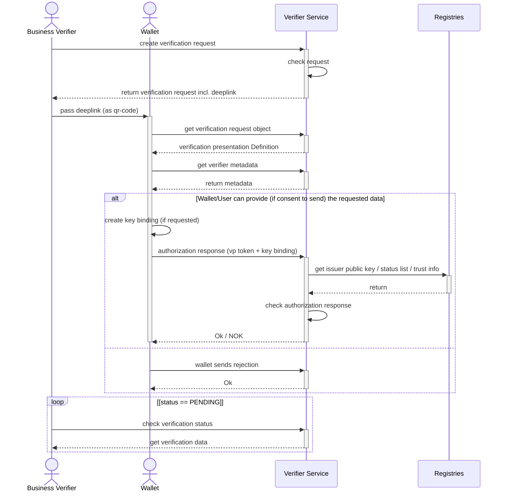

# Verification Process Details

This document provides insights about the verification V1 process and how to securely use a verification process.

## 1. Overview of the Verification V1 process

> [!NOTE]  
> Please note that this is a simplified overview of the process used to show the interactions between the involved parties (specially between the Verifier Service and the Wallet).
> Internal Wallet operations (like user authentication, user consent, etc.) are not shown in this diagram, also the interactions with the Registries are simplified.


```mermaid
sequenceDiagram
    actor bv as Business Verifier
    actor w as Wallet

    participant vs as Verifier Service
    participant registry as Registries


    bv->>+vs : create verification request
    vs->>vs : check request
    vs-->>-bv : return verification request incl. deeplink

    bv ->>+w : pass deeplink (as qr-code)
    w->>+vs : get verification request object
    vs-->>-w : verification presentation Definition

    w->>+vs : get verifier metadata
    vs-->>-w : return metadata

    alt Wallet/User can provide (if consent to send) the requested data
        w->> w : create key binding (if requested)
        w->>+vs : authorization response (vp token + key binding)
        vs->>+registry : get issuer public key / status list / trust info
        registry-->>-vs : return
        vs->>vs : check authorization response 
        vs-->>-w : Ok / NOK
        deactivate w
    else
        w->>+vs : wallet sends rejection
        vs-->>-w : Ok
    end

    loop [status == PENDING]
        bv->>+vs : check verification status
        vs-->>-bv : get verification data
    end
```

## 2. Interaction between Business Verifier and Verifier Service

> [!NOTE]  
> All calls use the localhost server at port 8083, which can be started with the sample-compose file [how to get started]().
> Adjust the URL as needed if you deployed the service elsewhere.

> [!NOTE]  
> This call works with the current version of the Beta-ID.

The Business Verifier exclusively uses the management api endpoints provided under `/management/api/`.

All interactions between the Wallet and the Verifier Service use the [OID4VP specification](https://openid.net/specs/openid-4-verifiable-presentations-1_0-ID2.html) and are provided under `/oid4vp/api/`

### 2.1. Create Verification

Actor:
- Business Verifier: The entity requesting the verification (e.g., a company or service).

Process:
- The Business Verifier initiates the process by sending a request to the Verifier Service to create a verification request.
- The Verifier Service stores this new request in the Verifier DB.
- After storing the request, the Verifier Service responds back to the Business Verifier with a Verification URI.
- The Business Verifier forwards the received Verification URI to the Holder (e.g., a person or entity holding credentials).

> [!IMPORTANT]  
> The example above is only a bare minimum working example to check that a person is older than 18 from a beta-id credential.

**Basic Request:**
```bash
curl -X POST \
  -H "Content-Type: application/json" \
  -d '{
  "accepted_issuer_dids": [
    "did:tdw:QmPEZPhDFR4nEYSFK5bMnvECqdpf1tPTPJuWs9QrMjCumw:identifier-reg.trust-infra.swiyu-int.admin.ch:api:v1:did:9a5559f0-b81c-4368-a170-e7b4ae424527"
  ],
  "jwt_secured_authorization_request": true,
  "response_mode": "direct_post",
  "verification_purpose": {
    "scope": "ch.some.test.scope",
    "purpose_name": {
      "default": "Test"
    },
    "purpose_description": {
      "default": "This is a test and this its description"
    }
  },
  "dcql_query": {
    "credentials": [
      {
        "id": "age_check_dcql",
        "format": "dc+sd-jwt",
        "meta": {
          "vct_values": ["betaid-sdjwt"]
        },
        "claims": [
          {
            "path": ["age_over_18"]
          }
        ],
        "require_cryptographic_holder_binding": true
      }
    ]
  }
}' \
http://localhost:8083/management/api/verifications
```

> **Note:** The verifier accepts both `dc+sd-jwt` (current spec, SD-JWT VC Draft 06+, per [draft-ietf-oauth-sd-jwt-vc-09 §A.2.1](https://datatracker.ietf.org/doc/html/draft-ietf-oauth-sd-jwt-vc-09#name-application-dcsd-jwt)) and `vc+sd-jwt` (legacy SD-JWT VC drafts ≤ 05) on the credential's `typ` header.

To limit the accepted issuers, you must either set the `accepted_issuer_dids` or the `trust_anchors` (not recommended, as it will be deprecated in the future) to create a verification request. 

In the example above the `accepted_issuer_dids` contains the id of the beta-id issuer. If you want to check your own issuer you have to set the value in here.
```json
{
    "...": "...",
    "accepted_issuer_dids": [
        "Your ISSUER_DID"
    ]
}
```
Alternatively, you can set the `trust_anchors` parameter to restrict the accepted issuers to those issued by trusted from the trust-registry.
List of trust anchor dids from the trust registry.
```json
{
    "...": "...",
    "trust_anchors": [
        "YOUR-TRUST-REGISTRY-ENTRY-DID"
    ]
}
```

> [!IMPORTANT]  
> The following example about vqps (Verification Query Public Statement) is under development and requires additional configuration. Please do not use it until further notice.

To set the vqps, you also have to set the `verification_purpose`
```json
{
    "...": "...",
    "verification_purpose": {
        "scope": "ch.some.test.scope",
        "purpose_name": {
            "default": "Test"
        },
        "purpose_description": {
            "default": "This is a test and this its description"
        }
    }
}
```

**Response:**

> [!NOTE]  
> Please store the `id` field from the response, as it is needed for further interactions. And will be used as `${VERIFICATION_ID}` in the following examples.
> The `verification_deeplink` can be used to create a QR code, which must then be provided to the wallet (must be done by the business verifier).

```json
{
    "id": "${VERIFICATION_ID}",
    "request_nonce": "aIxs7p648grTy9IOQLfF1JIeSpHH2Cia",
    "state": "PENDING",
    "verification_url": "https://...",
    "verification_deeplink": "swiyu-verify://?client_id=..."
}
```

### 2.2. Get Verification by ID

Actor:
- Business Verifier: The entity requesting the verification (e.g., a company or service).

Process:
- Returns the current status and provided data of a verification request to the business verifier.

**Request:**
```bash
curl -X GET \
  -H "Accept: application/json" \
  http://localhost:8083/management/api/verifications/${VERIFICATION_ID}
```

**Response:**
```json
{
    "id": "${VERIFICATION_ID}",
    "request_nonce": "aIxs7p648grTy9IOQLfF1JIeSpHH2Cia",
    "state": "PENDING",
    "verification_url": "https://...",
    "verification_deeplink": "swiyu-verify://?client_id=..."
}
```

## 3. Implementation Details for Wallets (not needed if you use the provided wallet)

### 3.1. Get Request Object
Actor:
- Wallet: The entity that holds the credentials.

Process:
- The Holder uses the Verification Deeplink and decodes it to retrieve the request object from the Verifier Service.
- The holder sends a GET request to the Verifier Service to retrieve the request object.
- The Verifier Service fetches the corresponding verification request from the Verifier DB.

> [!NOTE]  
> In order to get the url to get the request-object (including the REQUEST_ID), decode the `verification_deeplink` received in step 1 from the Business Verifier.

**Request:**
```bash
curl -X GET \
  -H "Accept: application/oauth-authz-req+jwt" \
  http://localhost:8083/oid4vp/api/request-object/{REQUEST_ID}
```

**Response:**  
Returns a signed JWT. A decoded example of the response could look like:
```json
{
    "response_uri": "http://localhost:8080/oid4vp/api/request-object/fef545ad-435e-4d10-87ea-922b1a0f5103/response-data",
    "aud": "https://self-issued.me/v2",
    "iss": "decentralized_identifier:did:example:12345",
    "response_type": "vp_token",
    "dcql_query": {
        "...": "..."
    },
    "state": "36d38875...",
    "nonce": "jbX1XQ81...",
    "client_metadata": {
        "jwks": {
            "keys": [
                {
                    "kty": "EC",
                    "kid": "bed0513c...",
                    "alg": "ECDH-ES",
                    "crv": "P-256",
                    "x": "WsYjs49...",
                    "y": "PvbmhOF..."
                }
            ]
        },
        "encrypted_response_enc_values_supported": [
            "A256GCM"
        ],
        "client_name#de": "German name (fallback)",
        "client_name#de-CH": "German name (region Switzerland)",
        "client_name#fr": "French name (all regions)",
        "client_name#de-DE": "German name (region Germany)",
        "logo_uri": "www.example.com/logo.png",
        "client_name#en": "English name (all regions)",
        "logo_uri#fr": "www.example.com/logo_fr.png",
        "client_name": "Fallback name",
        "client_id": "decentralized_identifier:did:example:12345",
        "vp_formats": {
            "jwt_vp": {
                "jwt_vp": {
                    "alg": [
                        "ES256"
                    ]
                }
            }
        },
        "response_mode": "direct_post.jwt"
    }
}
```

In this response you find several important claims which are used in the next steps:
- `response_uri`: The URL to which the wallet must send the presentation or refusal.
- `state`: The oauth-state value that must be sent back to the Verifier Service.
- `nonce`: The nonce value that must be sent back as part of the key-binding to the Verifier Service.
- `encrypted_response_enc_values_supported`: The encryption algorithms supported by the Verifier Service. The wallet must use one of these algorithms to encrypt the presentation before sending it.
- `client_metadata.client_id`: The DID of the Verifier Service. This value must be used as the `aud` claim in the key-binding.
- `client_metadata.jwks.keys`: List of JSON web keys (JWKs) to be provided as encryption option to the wallet.

### 3.2. Receive Verification Presentation

Actor:
- Wallet: The entity that holds the credentials.

> [!NOTE]  
> This call is done by the Wallet to send the presentation or refusal back to the Verifier Service. The wallet will send the vp_token as form parameters. An example of the encrypted_payload content is shown below:

```json
{
    "age_check_dcql" : [ "ey......" ]
}
```
The payload contains:
- As key: The id from  `dcql_query.credentials.id` (in this case `age_check_dcql`). 
- As value a list with (you can have multiple credentials for the same id, but only the first one will be used): 
  - The SD-JWT presentation (<Issuer-signed JWT>~<Disclosure 1>~...~<Disclosure N>~<Key-Binding>).
    - Disclosure 1 - N: The disclosure(s) of the claims (here only `age_over_18`) or in other cases the claims that are requested in the `dcql_query`.
    - Key-Binding: The key binding that proves the holder of the credential is the same as the one that created the presentation. The key binding is a signed JWT.

Decoded Key-Binding example:
> [!NOTE]  
> Audience must be set to the `client_id` of the Verifier Service and nonce must be set to the `nonce` value received in the request object.

```
{
  "typ": "kb+jwt",
  "alg": "ES256"
}
.
{
    "sd_hash": "...",
    "aud": "decentralized_identifier:did:example:12345",
    "iat": 12345678,
    "nonce": "jbX1XQ81..."
}
```


**Request:**
```bash
curl -X POST \
  -H "Content-Type: application/x-www-form-urlencoded" \
  -d "vp_token=encrypted_payload&state=the_oauth_state_from_the_request" \
  http://localhost:8083/oid4vp/api/request-object/${REQUEST_ID}/response-data
```

After receiving the request, the Verifier Service:
- Internally verifies the presentation.
- Requests the issuer's public key from the Base Registry to validate the credential.
- Checks the credential status with the Status Registry.
- Updates the verification result in the Verifier DB.

While the verification status remains PENDING:
- The Business Verifier periodically polls the Verifier Service to get the current status. 
- The Verifier Service reads the status from the Verifier DB and responds accordingly.

### 3.3 Rejection Example

Actor:
- Wallet: The entity that holds the credentials.

Process:
- The Holder may choose to reject the verification. 
- The Verifier Service updates the corresponding entry in the Verifier DB to reflect the rejection.

**Request:**
```bash
curl -X POST \
  -H "Content-Type: application/x-www-form-urlencoded" \
  -d "error=vp_formats_not_supported" \
  -d "error_description=I do not want to share this!" \
  http://localhost:8083/oid4vp/api/request-object/{request_id}/response-data
```